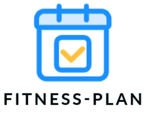
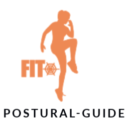
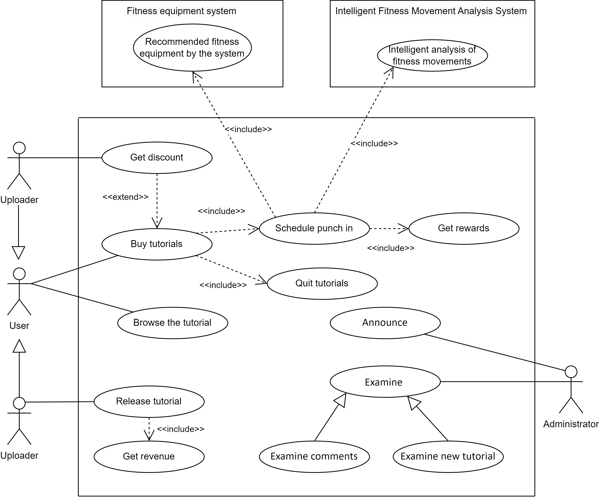
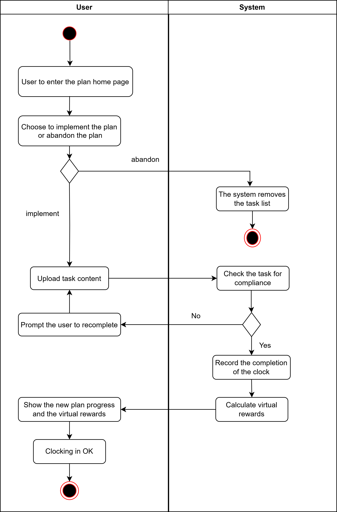
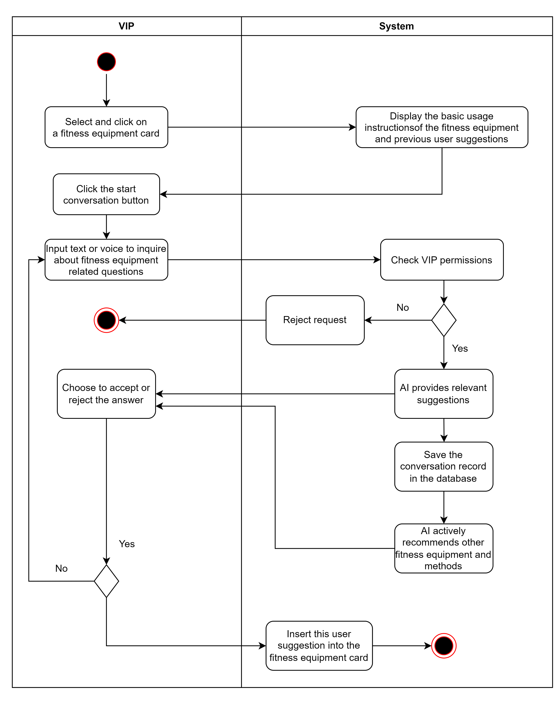
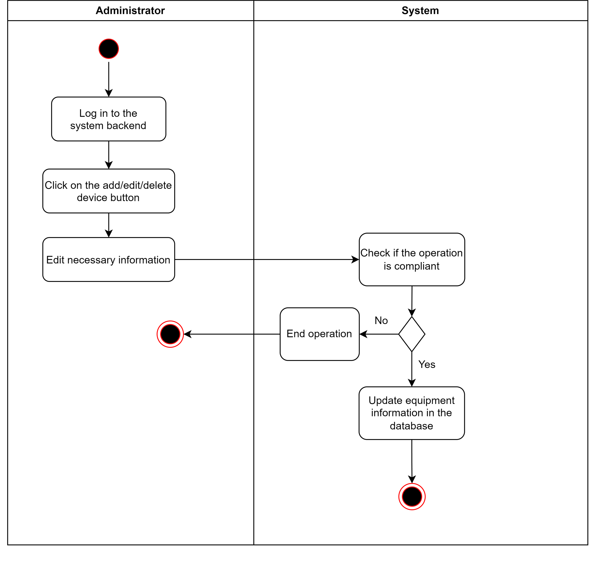
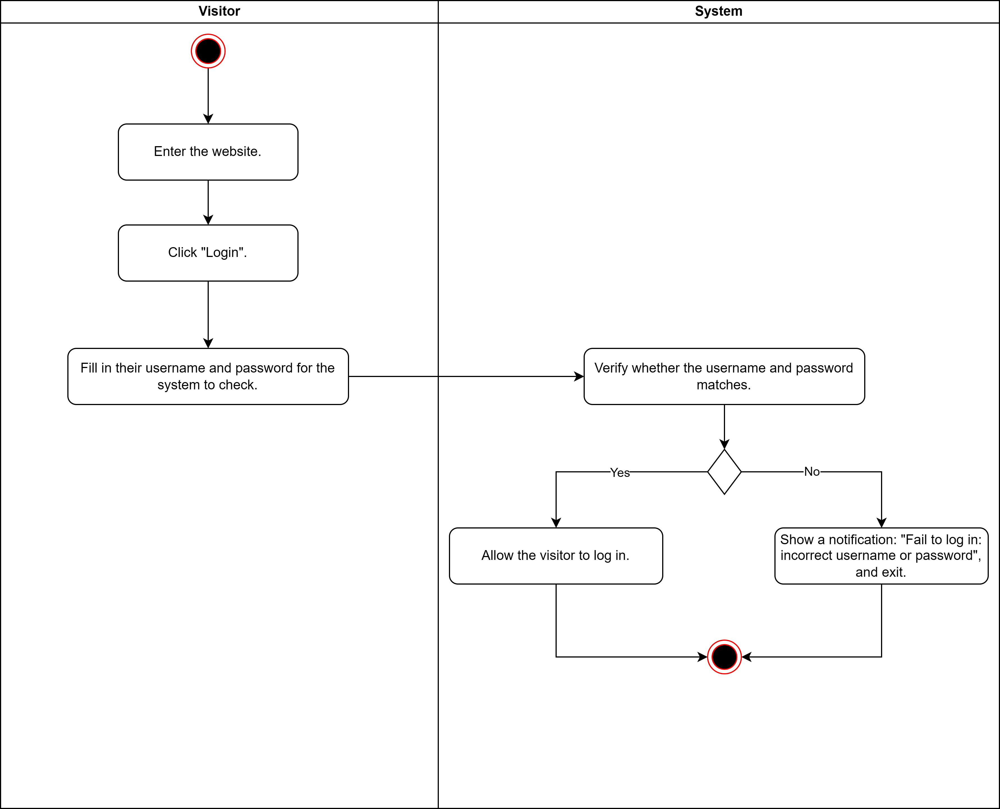
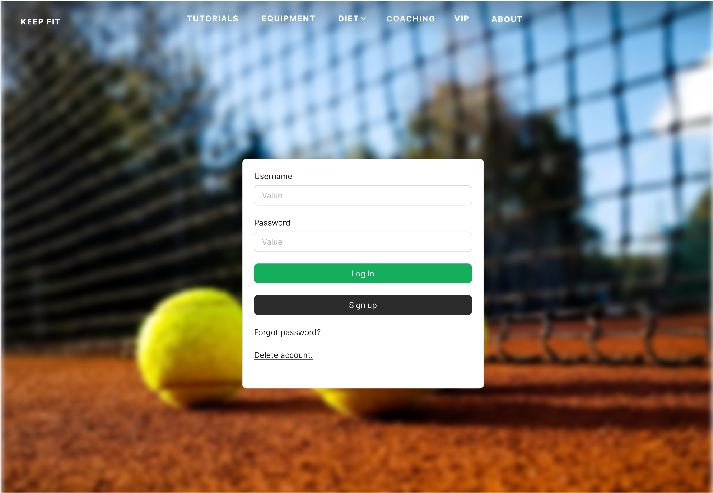

**Content**

[TOC]

# **1. Description**

## 1.1. Project Backgrounds

President Xi Jinping has pointed out that without good health for all, there can be no well off society in all respects. With the increase in people's health awareness, the demand for scientific fitness is also increasing. Keep Fit⸺Intelligent Fitness Manager aims to provide fitness courses for most fitness enthusiasts to meet users' needs for personalized  fitness guidance, scientific diet advice, action norms, and fitness equipment.

## 1.2. Project Goals

The project aims to simplify the fitness process through an integrated solution, integrating diet plans, exercise programs and equipment management, to help users achieve their fitness goals more intelligently and efficiently. The project not only provides personalized diet and exercise programs, but also dynamically adjusts according to the user's fitness schedule. The equipment management module will help users to select and optimize the use of fitness equipment. Through intelligent suggestions and real-time feedback, the project will also promote the development of users' fitness habits, and promote the trend of national fitness and the development of a healthy lifestyle.

This document is intended to provide readers with a clear and detailed description of the requirements, features, and functions of the Keep fit system to ensure that the applications developed will meet the objectives of the project. This document will also cover basic use cases to model and snapshot the user UI of the system, including some technical dependencies to give you a more intuitive understanding of the Keep fit system.

## 1.3. Project Scope

Keep-Fit is a Web-based smart fitness software, and the goal is to help users achieve their fitness goals smarter and more effectively. The main scenarios of the system include the selection of fitness tutorial, punching schedule, fitness posture guidance, food equipment recommendation and AI robot chat, etc. VIP members and ordinary users can browse information and participate in the activity after registering and logging in, and choose whether to become uploader. In addition, the platform administrators can maintain the platform order and keep the platform fitness content up to date.

  
  
  
  
  
  
  

In addition, Keep-Fit also has the following characteristics:

- The platform system operates in a network environment.
- The system has an accurate recommended fitness tutorial algorithm.
- The intelligent system allows users to chat and consult with the AI.
- Have a safe and reliable database to ensure information security.

## 1.4. Target Readers and Suggestions

- **Potential Investors**: This document can act as a **Business Proposal** for potential future investors to understand the key ideas and features of our project. For readers of this kind, they should pay more attention to ***Introduction(1.)***, ***Mock-up*** *** UI(5.)*** , and ***SWOT Analysis(6.)*** to get a general sense of this project and to evaluate its potential.
- **Fitness** **Enthusiast**: For fitness enthusiasts who are uncertain of what platform/app to choose to help with their exercise, this document should be able to act as an advertisement and introduction to our project. The ***Project Features(1.4)*** section should help them to determine whether our product will meet their need better than competing products, and the ***Mock-up*** ***UI(5.)*** section will help them find out if they like our product emotionally. 
- **Future Developers**: Quite a large portion of this document is for those developers who will join us in the future so they can be part of the design and implementation seamlessly. For them, every part of this document is essential to understand, but it would be better to start from the ***Introduction(1.)*** first to know what this project is all about, and then the ***Glossary of terms(2.)*** to prepare for the rest of the reading. 

# **2. Introduction**

## 2.1. Product Overview

The KeepFit system is a complete Web application containing the front-end Web end and back-end server parts. The server is responsible for processing user requests and interacting with the database to provide relevant data. Different user roles request different types of data from the server depending on their permissions. The server will return the corresponding data according to the role and permissions of the requester, such as tutorial management, device management, fitness records, and other functions. More detailed requirements and information will be further elaborated in the use case section, including the specific operational process and interaction details of each role.

## 2.2. Product Features

- Network support: this system is capable of a full user experience with a smooth network, but supports downloading tutorials so that users can exercise without an internet connection.
- Strict access rights. Different access rights are set for different users (regular users,VIP users, uploaders, administrator, etc.).
- User-friendly. The UI of this system is simple and beautiful, and the operation is clear, which makes it easy for users to use.
- Functionality. The system integrates fitness tutorials, movement checks, diet plans and other functions into one, and is committed to creating an all-in-one fitness platform centered on fitness tutorials.

## 2.3. Actors

In our KeepFit system that we have designed, there are five user roles, they are **visitors, ordinary users, VIP, Uploaders and administrators**,each with different functions and permissions:

**Visitors** can access the system without the need to register, but they can only browse part of the public content, and cannot participate in the course learning or conduct interactive operations such as punching in.

**Ordinary users** can pay and use most fitness tutorials, punch in every day, get basic dietary advice and equipment recommendations, and enjoy basic fitness guidance services.

In addition to enjoying all the functions of ordinary users, **VIP users** can also unlock more high-quality fitness courses, obtain personalized diet and training plans, and enjoy exclusive equipment management and priority technical support (such as more intelligent AI conversations).

**Uploaders** can upload and post their own fitness tutorials to attract other users to learn. The Uploaders can make revenue by watching and learning from the tutorial, and is the content creator on the platform.

**The administrator** is responsible for the overall management of the system and has the highest authority. They can review and manage the content published by the Uploader, manage user accounts, publish system announcements, and ensure the normal operation and safety of the platform.

These roles provide rich functions and flexible user experience, and meet the needs of different levels of users.

# **3. Glossary of terms**

| English terms                  | Terminology interpretation                                   |
| :----------------------------- | :----------------------------------------------------------- |
| **Keep-Fit**                   | The name of our project, the intelligent fitness platform, is designed to help users achieve their fitness goals smarter and more effectively. |
| **User**                       | The most basic users of the intelligent fitness platform can access the platform through registration, and use the most basic functions of the platform. |
| **VIP Member**                 | Ordinary users can become VIP members by recharging, and VIP members can use the richer functions in the platform, such as some paid tutorials, more intelligent AI chat systems and more accurate recommendation systems. |
| **Uploader**                   | Each kind of user(Users and VIP Members) can become a Uploaders by uploading exercise tutorials and sharing fitness experiences, and the Uploaders can also gain revenue and fans by selling paid fitness tutorials. |
| **Administrator**              | The administrator needs to maintain the order of the platform and the stability of the environment, and can ban the illegal users. You can also make announcements, upload new fitness tutorials, diet combinations and fitness equipment, and so on. |
| **Fitness** **Tutorial**       | Fitness tutorials are uploaded by uploaders or administrators, including paid and free, and cover a variety of fitness categories. |
| **Check-in**                   | After the user selects a fitness tutorial, the system automatically generates daily tasks and plans for the tutorial (the user can also plan the tutorial by himself/herself). Users need to complete the tasks every day to check in. |
| **AI** **Motion Detection**    | Users can upload photos of themselves during their workout process, and the system's AI will automatically check whether the exercise movements meet the specifications and give appropriate suggestions. |
| **Nutritional Composition**    | After the user selects a fitness tutorial, the system will automatically generate the recommended diet package of the tutorial, and give the nutritional composition of the package. Users can also take photos and upload daily diet pictures, and the AI system will automatically identify and give the nutritional content list of the diet. |
| **Reward** **Mechanism**       | Users need to complete the corresponding tasks every day according to the daily plan generated by the system(or tasks planning by himself/heself). After completing the tasks, they can get virtual rewards (such as level growth and platform transaction currency). |
| **Report**                     | Administrators regularly make announcements to various users of the platform, including some important notifications, new tutorials, and the latest feature points on the platform. |
| **Fitness** **Equipment**      | Each fitness course is accompanied by a series of required fitness equipment, the system will give the corresponding purchase links and size size recommendations. |
| **Chat Platform**              | In the chat platform, users can chat not only with their friends, but also with the system's AI robot, which can answer anything about fitness intelligently. |
| **Multi-device Access**        | Users can access and use the functions of the platform through different devices (such as personal computers, tablets, smartphones, etc.). This flexible access approach can improve the user experience and engagement. |
| **Intelligent Recommendation** | The system automatically generates personalized suggestions based on the users' personal information, fitness goals, history, and preferences. |

# **4. Specific Requirement**

## 4.1. Agile development and requirement analysis

- **Persona**

The primary goal of developing the “Keep Fit” platform is to create a comprehensive, all-inclusive fitness solution tailored specifically for fitness enthusiasts. In order to ensure the platform meets the diverse needs of its users, during the system function exploration phase, this document outlines a detailed analysis of various types of users. These user profiles are categorized based on individual personality traits, unique characteristics, living environments, and personal values. Building upon this analysis, a detailed user persona has been developed to better understand and address the specific requirements and preferences of different user groups. This approach helps ensure that the platform is intuitive, accessible, and effective for all users, regardless of their fitness backgrounds or lifestyles.

- **Empathy map**

Depending on the profiles of different users, we can build an empathy map from the user's perspective. Through in-depth analysis of users 'thinking, language expression, daily experiences, behaviors and emotional states, we can better understand users' needs and confusion in daily life. With the help of this analysis, we can optimize the functions of the system to make it more suitable for users' real use scenarios, so as to provide more personalized and targeted services. This design idea from the user's perspective will help us improve the user experience of the system and meet the diverse needs.

- **User story**

By summarizing and analyzing different user portraits and empathy maps, we have a deep understanding of the expectations and needs of various users for the system. Through these analyses, we can not only grasp the user's behavior patterns, pain points and goals, but also can more accurately identify the specific problems and challenges they encounter in the process of use. These valuable insights allow us to fully show the real needs of our users and express them in the form of their user stories.This approach not only helps us to better navigate the product during the design and development phase, but also ensures that the features we develop are highly compatible with the core needs of the users, thus improving the satisfaction of the user experience and the overall practicality of the system.

- **User journey map**

In the system design process, the user stories are classified according to the needs of different users, and the user interaction steps of the users with the system are gradually described to help them achieve their respective goals. This process not only focuses on the user's behavior during the operating system, but also tracks their psychological changes at different stages. By building the user journey map, we can intuitively understand the user's emotional fluctuations during use, identify pain points and opportunities for improvement. This approach helps us optimize the system functionality design, ensuring that each new feature better meets the user needs and provides a smoother experience.

- **User story map**

On this basis, we can deeply analyze the most urgent needs of the system, as well as some excellent ideas that can be improved. By sequencing the urgency of these needs, we mapped the user stories. User story maps can not only help us build use-case models, but also assign team tasks properly. Based on the concept of agile development, we can develop a feasible version of the system in the shortest time, and constantly update the system according to the needs of users, so as to ensure that the functions of the system are more in line with the actual needs of users and improve the user experience. At the same time, this approach also improves the development efficiency, ensuring that the team can quickly respond to market changes and user feedback during each iteration cycle, and continuously optimize the system functions.

## 4.2. Use Cases Modeling

### 4.2.1. Global View on Use Case

This is the overall use-case diagram of our system:

### 4.2.2. Login & Register System

**Use Case Diagram**

**Detailed Specification for Use Case**

Use Case: **Register**

---

| USE CASE              | REGISTER                                                     |
| --------------------- | ------------------------------------------------------------ |
| **ID**                | ***UC01***                                                   |
| **Specification**     | Visitors register their own accounts and fill in their personal information. The system verifies the information and allows the user to set the password. |
| **Actors**            | **Visitor**                                                  |
| **Pre-condition**     | Visitors enter the login webpage and click "Sign  In".       |
| **Basic Path**        | 1. Visitors enter the website.  2. Visitors click "sign up".  3. Visitors fill in their personal information and get verified.  <tab/>3.1 Visitors fill in their personal information, including their phone numbers and email addresses. <tab/>3.2 The system verifies the phone number and email address by sending some links for the users to click. <tab/>3.3 Visitors prove their info valid by clicking those links. 4. Visitors set their password for login. 5. Visitors successfully create a user account. |
| **Alternative  Path** | 1. Visitors exit the webpage during information filling  <tab/>The system will show a notification: "Information filling  incomplete, do you want to exit any way?"  2. Visitors fail to click those links to verify their information within some time limit:  <tab/>The system will show a notification: "Fail to verify your information.", and log out.  |
| **Post condition**    | Visitors get their personal accounts.                        |

Use Case: **Login**

---

| USE CASE              | LOGIN                                                        |
| --------------------- | ------------------------------------------------------------ |
| **ID**                | ***UC02***                                                   |
| **Specification**     | Visitors type in their account ID and password to log in to the account. |
| **Actors**            | **Visitor**                                                  |
| **Pre-condition**     | Visitors have their own account and click "login" on the website. |
| **Basic Path**        | 1. Visitors enter the website.  2. Visitors click "login".  3. Visitors fill in their username and password for the system to check.  <tab/>3.1  Visitors fill in their username and password. <tab/>3.2 The system verifies the correctness of the username and password 4. Visitors successfully log in. |
| **Alternative  Path** | 1. Visitors input the username and password that do not match  <tab/>The system will show a notification: "Fail to log in: incorrect username or password", and exit. |
| **Post condition**    | Visitors enter the system, become users, and can access users'  operations. |

Use Case: **Reset Password**

---

| USE CASE              | RESET PASSWORD                                               |
| --------------------- | ------------------------------------------------------------ |
| **ID**                | ***UC03***                                                   |
| **Specification**     | Visitors who forget their username and/or their password can reset their password with their communication information. |
| **Actors**            | **Visitor**                                                  |
| **Pre-condition**     | Visitors have their own account and click "Reset Password" on the website. |
| **Basic Path**        | 1. Visitors enter the website.  2. Visitors click "Reset Password".  3. Visitors fill in their communication information used during their registration.  4. The system sends a text including their username and a link to reset the password.  5. Visitors click the link and enter a webpage to reset their password. |
| **Alternative  Path** | 1. Visitors input the wrong personal information  <tab/>The system will do exactly **NOTHING** to avoid malicious users. |
| **Post condition**    | Visitors will again know their username and password.        |

Use Case: **Delete Account**

---

| USE CASE              | Delete Account                                               |
| --------------------- | ------------------------------------------------------------ |
| **ID**                | ***UC04***                                                   |
| **Specification**     | Visitors can delete their accounts.                          |
| **Actors**            | **Visitor**                                                  |
| **Pre-condition**     | Visitors have their own account, and click "Delete Account" on the website. |
| **Basic Path**        | 1. Visitors enter the website.  2. Visitors click "Delete Account".  3. Visitors log in to the account.  4. The system verifies again if the users want to delete the account.  4. The user chooses "Yes".  4. The system deletes the account in the database and logs the user out. |
| **Alternative  Path** | 1. Visitors fail to log in, or choose "No" on the final confirmation  <tab/>The system will abort the deletion operation. |
| **Post condition**    | Visitors will delete their accounts.                         |

### 4.2.3. Fitness Tutorial Section

**Use Case Diagram**

**Detailed Specification for Use Case**

Use Case: **User Browse The Tutorials**

---

| **USE CASE**         | User Browse The Tutorials                                    |
| -------------------- | ------------------------------------------------------------ |
| **ID**               | ***UC05***                                                   |
| **Specification**    | This use case describes how the user browses the available tutorials in the system. Users can view the list of tutorials, access details, and decide whether to proceed with a purchase. |
| **Actors**           | **User**, **System**                                         |
| **Pre-condition**    | 1. The user is logged in to the system. 2. The user has a stable network connection. |
| **Basic Path**       | 1. The user selects the 'Browse Tutorials' option. 2. The system displays a list of tutorials. 3. The user can filter or sort the tutorials. 4. The user clicks on a tutorial of interest to view its details. 5. The system shows the tutorial's details, including introduction, duration, difficulty, and score. |
| **Alternative Path** | **User Not Logged In**: 1. If the user is not logged in, the system prompts them to log in. 2. The user can choose to log in or register to continue browsing. **No Tutorials Available**: 1. If no tutorials are available, the system displays a message informing the user that no tutorials are currently available. |
| **Post-condition**   | The user successfully browses the tutorial list.             |

Use Case: **Users Buy The Tutorials**

---

| **USE CASE**         | Users Buy The Tutorials                                      |
| -------------------- | ------------------------------------------------------------ |
| **ID**               | ***UC06***                                                   |
| **Specification**    | This use case describes how the user selects and buys the tutorial in the system. Users can browse the tutorial, select the required tutorial, and complete the payment process. |
| **Actors**           | **User**, **System**                                         |
| **Pre-condition**    | 1. The user has logged in to the system. 2. The user has a valid payment method. 3. The user has browsed and selected the tutorial to purchase. |
| **Basic Path**       | 1. The user selects the "Buy" button on the tutorial details page. 2. The system displays the order details, including the tutorial name, price, and purchase conditions, and the user confirms the purchase. 3. The user selects the required payment method. 4. The system submits the payment request to the payment system. 5. The payment system processes the payment information and completes the payment. |
| **Alternative Path** | **Payment Failure**: 1. If an error occurs during the payment, the payment system returns a failure message. 2. The system informs the user of the failure and allows them to reselect a payment method or retry later. **Purchase Cancellation**: 1. Users can cancel the purchase before confirming payment, returning to the tutorial details page. |
| **Post-condition**   | 1. The user successfully buys the tutorial. 2. The system updates the user's rights, allowing them to access and learn the purchased tutorial. |

Use Case: **VIP Users Get Discounts**

---

| **USE CASE**         | VIP Users Get Discounts                                      |
| -------------------- | :----------------------------------------------------------- |
| **ID**               | ***UC07***                                                   |
| **Specification**    | This use case describes how VIP users automatically receive discounts when purchasing tutorials or other services. VIP users can complete purchases at a reduced price based on the system's discount rules. |
| **Actors**           | VIP User, System, Payment System                             |
| **Pre-condition**    | 1. The user is registered as a VIP. 2. The user has selected a tutorial or service to purchase. 3. The system has discount rules configured for VIP users. |
| **Basic Path**       | 1. VIP user selects a tutorial or service to purchase. 2. The system automatically calculates and displays the discounted price. 3. VIP user confirms the purchase and chooses a payment method. 4. The system sends the discount details and payment request to the payment system. 5. The payment system processes the payment and returns a success message. 6. The system confirms the successful payment and completes the discounted purchase for the VIP user. |
| **Alternative Path** | **Payment Failure**: 1. If the payment fails, the system notifies the VIP user of the failure reason. 2. The VIP user can choose another payment method or retry later. **Purchase Cancellation**: 1. The user can cancel the purchase before confirming payment, and the system will halt the purchase process, leaving the tutorial unbought. |
| **Post-condition**   | 1. The VIP user successfully purchases the tutorial or service with the discount applied. 2. The system updates the VIP user’s purchase history and remaining discount opportunities (if applicable). |

Use Case: **User Punch Schedule**

---

| **USE CASE**         | User Punch Schedule                                          |
| -------------------- | ------------------------------------------------------------ |
| **ID**               | ***UC08***                                                   |
| **Specification**    | This use case describes how users can punch in on their fitness schedule to track progress and gain rewards. Users can follow their selected schedule, and the system records their daily check-ins. |
| **Actors**           | **User**, **System**                                         |
| **Pre-condition**    | 1. The user is successfully logged into the system. 2. The user has purchased a tutorial and is enrolled in a fitness schedule. |
| **Basic Path**       | 1. The user selects the 'Punch Schedule' option on their dashboard. 2. The system displays the current day's schedule. 3. The user clicks the 'Punch In' button to confirm their workout. 4. The system will redirect to the page for AI analysis of fitness movements.  5. Users need to upload videos of the movements in the plan, and once the AI analysis is passed, they can complete the check-in process 6. The system records the punch and grants any virtual rewards associated with the check-in. |
| **Alternative Path** | 1. If the user tries to punch in for a tutorial they haven’t purchased, the system displays an error message prompting them to buy it first. 2. If there is no schedule for the day, the system informs the user that there is no workout scheduled. 3. When the user is in the state of checking in for a certain tutorial, the system will intelligently recommend the corresponding equipment usage method in the fitness equipment module |
| **Post-condition**   | 1. The user's punch is successfully recorded. 2. The user earns any virtual rewards for completing the daily schedule. |

Use Case: **User Exits Tutorials**

---

| USE CASE             | User Exits Tutorials                                         |
| -------------------- | ------------------------------------------------------------ |
| **ID**               | ***UC09***                                                   |
| **Specification**    | This use case describes how a user exits a tutorial they have been viewing. Users can leave the tutorial at any time and resume from the last point when they return. |
| **Actors**           | **User**, **System**                                         |
| **Pre-condition**    | The user has purchased the tutorial and is currently viewing it. |
| **Basic Path**       | 1. The user clicks on the "Exit" button while viewing the tutorial. 2. The system saves the user's progress in the tutorial. 3. The system confirms the user's progress has been saved and exits the tutorial view. |
| **Alternative Path** | 1. If the user has not made progress, the system exits without saving. 2. If there is a system error, the user is notified and can try again later. |
| **Post-condition**   | The user exits the tutorial, and their progress is saved for future access. |

Use Case:  **Users Receive Virtual Rewards **

---

| USE CASE             | Users Receive Virtual Rewards                                |
| -------------------- | ------------------------------------------------------------ |
| **ID**               | ***UC10***                                                   |
| **Specification**    | This use case describes how users (VIP) receive virtual rewards for their achievements on the platform. Virtual rewards could be points, badges, or other system rewards. |
| **Actors**           | **User**, **System**                                         |
| **Pre-condition**    | The user has completed a predefined action or milestone within the system (e.g., completing a tutorial, making a purchase, or reaching a fitness goal). |
| **Basic Path**       | 1. The user completes a predefined task (e.g., finishing a tutorial, achieving a fitness goal, etc.). 2. The system verifies the task completion. 3. The system awards virtual rewards (points, badges, etc.) to the user. 4. The system displays the virtual rewards to the user. |
| **Alternative Path** | 1. If the task is not completed properly or there is an error in the system, no rewards are granted. 2. The system notifies the user about the issue and allows them to retry or contact support. |
| **Post-condition**   | The user successfully receives the virtual rewards and can view them in their profile or rewards section. |

Use Case:  **Uploader uploads a new tutorial **

---

| USE CASE             | UpLoader uploads a new tutorial                              |
| -------------------- | ------------------------------------------------------------ |
| **ID**               | ***UC11***                                                   |
| **Specification**    | This use case describes how an UpLoader uploads a new tutorial to the system. The tutorial will be available for users to browse and buy after it is approved. |
| **Actors**           | **UpLoader**, **Admin**,**System**                           |
| **Pre-condition**    | The UpLoader is logged into the system and has the necessary credentials to upload a new tutorial. |
| **Basic Path**       | 1. The UpLoader selects the 'Upload New Tutorial' option. 2. The system displays a form to input tutorial details (title, description, category, etc.). 3. The UpLoader fills in the required information and submits the tutorial. 4. The system sends the tutorial for admin approval. 5. The Admin reviews the tutorial and either approves or rejects it. 6. If approved, the tutorial becomes available on the platform. 7. The system notifies the UpLoader about the status of the tutorial. |
| **Alternative Path** | 1. If the UpLoader fails to provide all required information, the system prompts them to complete the missing fields. 2. If the tutorial is rejected, the system notifies the UpLoader and provides feedback on the rejection. |
| **Post-condition**   | The new tutorial is uploaded and either pending approval or available on the platform after admin approval. |

Use Case:  **Uploader gets revenue **

---

| USE CASE             | Uploader gets revenue                                        |
| -------------------- | ------------------------------------------------------------ |
| **ID**               | ***UC12***                                                   |
| **Specification**    | This use case describes how the uploader earns revenue from the tutorials they upload. Revenue is earned based on tutorial sales or other conditions set by the system. |
| **Actors**           | **Uploader**, **System**                                     |
| **Pre-condition**    | The uploader has uploaded a tutorial and the tutorial has been purchased by users. |
| **Basic Path**       | 1. Users purchase the uploader's tutorial. 2. The system tracks the number of sales and revenue generated for each tutorial. 3. The system calculates the revenue based on the price and shares it with the uploader according to the system's policy. 4. The system updates the uploader's earnings in the user account. 5. The uploader can view their revenue earnings in the dashboard. |
| **Alternative Path** | 1. If no users purchase the tutorial, the uploader earns no revenue. 2. If there is an issue with the payment process, the system informs the uploader and refunds if necessary. |
| **Post-condition**   | The uploader successfully receives revenue from their tutorial sales, and the system records the earnings in the uploader's account. |

Use Case:  **The Administrator Issues Announcements **

---

| USE CASE             | The Administrator Issues Announcements                       |
| -------------------- | ------------------------------------------------------------ |
| **ID**               | ***UC13***                                                   |
| **Specification**    | This use case describes how the system administrator issues announcements to all users. Announcements may include system updates, tutorials, events, or general notices. |
| **Actors**           | **Administrator**, **System**                                |
| **Pre-condition**    | The administrator is logged into the system and has the necessary privileges to issue announcements. |
| **Basic Path**       | 1. The administrator logs into the system. 2. The administrator navigates to the 'Announcements' section. 3. The administrator enters the announcement content and selects the target audience (all users or specific groups). 4. The administrator submits the announcement. 5. The system displays the announcement to the intended audience. |
| **Alternative Path** | 1. If the administrator fails to submit the announcement due to a network issue or incorrect input, the system returns an error message. 2. The administrator can edit or delete the announcement before submission. |
| **Post-condition**   | The announcement is successfully issued and displayed to the users, and the system updates the announcement log. |

Use Case:  **The Administrator Reviews The Comments **

---

| USE CASE             | The Administrator Reviews The Comments                       |
| -------------------- | ------------------------------------------------------------ |
| **ID**               | ***UC14***                                                   |
| **Specification**    | This use case describes how the system administrator reviews comments left by users on tutorials or other content. The administrator can approve, delete, or report inappropriate comments. |
| **Actors**           | **Administrator**, **System**                                |
| **Pre-condition**    | The administrator is logged into the system and has permission to manage comments. |
| **Basic Path**       | 1. The administrator logs into the system. 2. The administrator navigates to the 'Comments Management' section. 3. The system displays a list of comments for review. 4. The administrator selects a comment to review. 5. The administrator decides to either approve, delete, or report the comment as inappropriate. 6. The system updates the comment status based on the administrator's action. |
| **Alternative Path** | 1. If the administrator encounters a system error while reviewing the comments, the system will prompt an error message. 2. The administrator can choose to return to the comment list without making any changes. |
| **Post-condition**   | The comment is successfully reviewed and the system updates the comment status accordingly. |

Use Case:  **The Administrator Reviews The New Tutorials **

---

| USE CASE             | The Administrator Reviews The New Tutorials                  |
| -------------------- | ------------------------------------------------------------ |
| **ID**               | ***UC15***                                                   |
| **Specification**    | This use case describes how the administrator reviews new tutorials uploaded by the users. The administrator can approve, reject, or ask for edits before the tutorial goes live. |
| **Actors**           | **Administrator**, **System**                                |
| **Pre-condition**    | The administrator is logged into the system and has access to tutorial management. |
| **Basic Path**       | 1. The administrator logs into the system. 2. The administrator navigates to the 'New Tutorials' section. 3. The system displays a list of new tutorials uploaded by users. 4. The administrator selects a tutorial to review. 5. The administrator reviews the tutorial content, including title, description, video/audio, and other details. 6. The administrator decides to approve, reject, or ask for edits. 7. The system updates the tutorial status based on the administrator's decision. |
| **Alternative Path** | 1. If the administrator encounters an error when reviewing the tutorial, the system displays an error message. 2. The administrator may choose to return to the tutorial list without making any decision. |
| **Post-condition**   | The tutorial is reviewed and the system updates its status as approved, rejected, or pending edits. |

### 4.2.4. Fitness Action Coaching Section

**Detailed Specification for Use Case**

Use Case: **Fitness Action Coaching**

---

| USE CASE             | Fitness Action Coaching                                      |
| -------------------- | ------------------------------------------------------------ |
| **ID**               | ***UC16***                                                   |
| **Specification**    | Users can upload images or videos of fitness movements and use AI intelligent analysis to correct them. VIP users have more usage quotas. |
| **Actors**           | **User, VIP, System**                                        |
| **Pre-condition**    | The user has successfully logged into the system and selected the intelligent fitness action analysis function page. |
| **Basic Path**       | 1. The user logs into the system and enters the intelligent fitness action analysis page. 2. Users upload pictures or videos of fitness movements and enter the corresponding movement names. 3. The system conducts a legality review of the uploaded content to determine whether the images or videos meet the requirements (such as format, authenticity of content, etc.). 4. After the legality review is approved, the system launches the AI analysis module to analyze the uploaded fitness movements and evaluate their standardization and accuracy. 5. The system will display the analysis results to the user, including action standardization ratings, improvement suggestions, etc. 6. The system checks the usage frequency of ordinary users. If it exceeds the limit of 5 times per day, it prompts the user to upgrade to VIP or use again the next day. |
| **Alternative Path** | 1. If the system detects that the uploaded image or video does not meet the requirements, the system will prompt the user that the upload has failed and provide a reason (such as incorrect format, unclear content, etc.). 2. When an ordinary user exceeds the limit of 5 free uses per day, the system prompts the user that they cannot conduct further analysis unless they upgrade to VIP. 3. After VIP users upload content and enter the action name, the system directly starts action analysis without the need for multiple checks. 4. If users use the AI analysis action function through the channel of check-in fitness tutorials, there are no usage restrictions |
| **Post-condition**   | The system provides users with a detailed analysis report of actions, and the results are saved in the user's analysis history after the analysis is completed. |

### 4.2.5. Fitness Equipment Section

**User Case Diagram**

**Detailed Specification for Use Case**

Use Case: **View the basic usage of fitness equipment**

---

| USE CASE             | View the basic usage of fitness equipment                    |
| -------------------- | ------------------------------------------------------------ |
| **ID**               | ***UC17***                                                   |
| **Specification**    | Users view the basic instructions for using the fitness equipment recommended by the system |
| **Actors**           | **User**, **VIP**, **Administrator**                         |
| **Pre-condition**    | Successfully logged into the system as a user                |
| **Basic Path**       | 1. Users enter keywords or browse device lists on the fitness equipment page to find fitness equipment that interests them. 2. When the user clicks on a fitness equipment card of interest, the system displays the detailed page of the device. 3. The system displays the basic usage methods of fitness equipment, including equipment usage steps, precautions, and other content. 4. The user clicks on the blank area or "back" button on the page to exit the device details page and return to the main page. |
| **Alternative Path** | 1. Users can click the "Refresh" button to obtain the latest recommended fitness equipment from the system. The system displays the latest recommended list, from which users can select devices of interest. 2. The user selects to view the "Device Usage Video" on the device detail page. The system plays a video of the device's usage, allowing users to have a more intuitive understanding of how to use the device. 3. If the user is interested in the fitness equipment, select the "Favorites" button to add the device to their personal favorites. The system displays a prompt of "successfully bookmarked" and adds the device to the user's favorites. 4. When the user is in the state of checking in for a certain fitness tutorial, the system will recommend fitness equipment related to that fitness tutorial |
| **Post-condition**   | The user successfully obtained the instructions for using fitness equipment |

Use Case: **Fitness equipment AI intelligent Q&A**

---

| USE CASE             | Fitness equipment AI intelligent Q&A                         |
| -------------------- | ------------------------------------------------------------ |
| **ID**               | ***UC18***                                                   |
| **Specification**    | VIP users can engage in intelligent Q&A and immersive understanding of equipment usage and fitness methods with the fitness coach agent |
| **Actors**           | **VIP**                                                      |
| **Pre-condition**    | User successfully logged in and holds VIP status             |
| **Basic Path**       | 1. VIP users select a fitness equipment card in the system. 2. The system displays the basic usage instructions of the fitness equipment, including precautions and key parameters. 3. The user selects the "Start Dialogue" function to enter AI interactive mode. 4. Users can ask specific questions about the use of fitness equipment, exercise methods, and other related content through text or voice. 5. AI provides corresponding fitness knowledge or advice. 6. When the user chooses to end the conversation, the system returns to the main page of the fitness equipment card. |
| **Alternative Path** | 1. The user requests to save the current conversation content for future reference.The system generates dialogue records and saves them to the user's personal profile. 2. AI actively recommends other fitness equipment or training methods based on user questions, such as: "If you are interested in leg exercises, you can try XX equipment 3. During the conversation, the user inquired about the maintenance information of the device, and the system detected an update in the device information. The system prompts users with the latest maintenance suggestions and synchronously updates the displayed information. |
| **Post-condition**   | After the conversation ends, the user receives more detailed information and advice on the use of fitness equipment. |

Use Case: **Manage fitness equipment information**

---

| USE CASE             | Manage fitness equipment information                         |
| -------------------- | ------------------------------------------------------------ |
| **ID**               | ***UC19***                                                   |
| **Specification**    | Administrators can manage detailed information about fitness equipment through the backend, including adding new devices, editing existing device information, and deleting devices. |
| **Actors**           | **Administrator**                                            |
| **Pre-condition**    | The administrator has successfully logged into the management backend interface of the system. |
| **Basic Path**       | 1. The administrator logs into the system backend and selects the "Fitness Equipment Management" module. 2. The administrator selects the "Add Device" button, fills in detailed information such as device name, type, and function description, and submits it for saving. 3. The administrator selects an existing device and clicks the "Edit" button to modify the device's name, instructions, or other information. 4. The administrator selects the device to be deleted and clicks the "Delete" button. 5. After completing the operation, the administrator can choose to exit the device management page and return to the main interface of the system. |
| **Alternative Path** | 1. The administrator entered incomplete or formatted information when adding a new device. Need to fill in or modify before submitting. 2. When deleting a device, the system requires the administrator to re-enter the account password for permission verification to ensure the security of the operation |
| **Post-condition**   | The information of fitness equipment has been successfully updated, and the device information in the system remains up-to-date. |

### 4.2.6. Fitness Diet Section

**User Case Diagram**

**Detailed Specification for Use Case**

Use Case: **Upload dietary record**

---

| USE CASE             | RECORD DIETARY INFORMATION                                   |
| -------------------- | ------------------------------------------------------------ |
| **ID**               | ***UC20***                                                   |
| **Specification**    | Users can record what they eat every day, including time, food type, food quantity, etc. |
| **Actors**           | **User,VIP**                                                 |
| **Pre-condition**    | Successfully logged into the system as a user.               |
| **Basic Path**       | 1. The use case starts when the User request to record dietary information.  2. User fills in dietary information: food photo, food type, quantity, etc.  3. User submits the record. |
| **Alternative Path** | 1. User not logged in 1.1. Prompt to log in 2.Incomplete recording of necessary information: no pictures uploaded 2.1.Prompt to upload pictures. 3.User saves incomplete records <tab />3.1 The user completes some of the information and selects Save as Draft. <tab />3.2 The system saves the unfinished diet record and prompts the user that they can continue editing later. |
| **Post-condition**   | Record uploaded successfully.                                |

Use Case: **AI analyses dietary records**

---

| USE CASE             | AI ANALYSIS RECORDS                                          |
| -------------------- | ------------------------------------------------------------ |
| **ID**               | ***UC21***                                                   |
| **Specification**    | VIP users can use big language models to intelligently analyse their diets per meal or per day and get advice. |
| **Actors**           | **VIP**                                                      |
| **Pre-condition**    | User successfully logged in and holds VIP status.            |
| **Basic Path**       | 1. Select a single record or a single day of records to be analysed. 2. Click on the button to analyse. 3. View analyses and recommendations. |
| **Alternative Path** | 1. User View Historical Analysis Results 1.1. The VIP user selects to view previous analyses. 1.2. The system displays the historical analysis data and the corresponding recommendations, and the user can refer to the historical data for comparison. 2. Saving analysis results 2.1. VIP users have the option to save analysis results to their personal profile. 2.2. The system saves the analysis results in the user's history for future reference |
| **Post-condition**   | Users successfully receive dietary analysis recommendations. |

Use Case: **Implementation of the diet plan**

---

| USE CASE             | IMPLEMENTATION OF THE DIET PLAN                              |
| -------------------- | ------------------------------------------------------------ |
| **ID**               | ***UC22***                                                   |
| **Specification**    | Users can view their diet plan and clock in here.            |
| **Actors**           | **User**, **VIP**                                            |
| **Pre-condition**    | User successfully logged into the system and has an active diet plan. |
| **Basic Path**       | 1. User accesses their diet plan. 2. User views suggested meals and portions for the day. 3. User records their meal consumption by checking off items from the list. 4. User updates the daily adherence status (e.g., complete, partial, not followed). 5. System saves the daily record and updates the adherence statistics. |
| **Alternative Path** | 1. User skips a meal. <tab/>1.1 User records the skipped meal. <tab/>1.2 System prompts for the reason for skipping. <tab/>.3 User provides the reason, and the system logs it for future reference. |
| **Post-condition**   | User's daily adherence status is updated, and statistics reflect the implementation of the diet plan. |

Use Case: **Publish the diet plans**

---

| USE CASE             | PUBLISH THE DIET PLANS                                       |
| -------------------- | ------------------------------------------------------------ |
| **ID**               | ***UC23***                                                   |
| **Specification**    | Uploaders can post diet plans based on their fitness tutorials. |
| **Actors**           | **Uploaders**                                                |
| **Pre-condition**    | Uploaders successfully logged into the system.               |
| **Basic Path**       | 1. Uploader provides a title, description, and any additional notes for the diet plan. 2. Uploader clicks the "Publish" button. 3.Wait for administrator review. |
| **Alternative Path** | 1. Selecting Privacy Settings <tab/>1.1. Uploader can select the diet plan's privacy settings (Public, Friends Only, Private) before publishing. <tab/>1.2. The system processes the posting based on the selected privacy settings. |
| **Post-condition**   | The diet plan is reviewed and successfully posted, and other users can see it in the public list. |

Use Case: **Manage the diet plans**

---

| USE CASE             | MANAGE THE DIET PLANS                                        |
| -------------------- | ------------------------------------------------------------ |
| **ID**               | ***UC24***                                                   |
| **Specification**    | Administrators can manage diet plans, including reviewing, editing, and deleting published plans to ensure compliance and quality. |
| **Actors**           | **Administrator**                                            |
| **Pre-condition**    | Administrator successfully logged into the system.           |
| **Basic Path**       | 1. Administrator accesses the list of published diet plans. 2. Administrator selects a diet plan to manage. 3. Administrator reviews the plan details. 4. Administrator chooses an action: edit, delete, or approve. 5. If editing:  <tab/>5.1 Administrator makes changes to the diet plan. <tab/>5.2 Administrator submits the updated plan. <tab/>5.3 System validates and saves the changes. 6. If deleting:  <tab/>6.1 Administrator confirms the deletion. <tab/>6.2 System removes the diet plan from the public listings. 7. If approving:  <tab/>7.1 System marks the diet plan as approved and displays it in the public listings. |
| **Alternative Path** | 1. Viewing Feedback and Comments <tab/>1.1. Administrator can view user feedback and comments on the diet plan. <tab/>1.2. Administrator decides whether changes to the diet plan are required based on the feedback. 2. Review History <tab/>2.1. Administrator can review the history of diet plan versions and modifications. <tab/>2.2. Administrator can revert to a previous version. |
| **Post-condition**   | The diet plans are successfully managed, reflecting the latest updates, deletions, or approvals in the system. |

## 4.3. Activity Diagrams

- **Buy Tutorials**

After logging in to the system, users can browse and choose the tutorial that they are interested in, click to view the details, choose the purchase and choose the payment method. The system will check whether the user is a VIP member, and the VIP can enjoy the discount. At the same time, the system checks whether the account balance is sufficient to cover the tutorial fees. After the successful payment, the system will deduct the corresponding amount and add the purchase record to the revenue database. The tutorial Uploader will receive revenue notifications and can view the specific revenue.

- **Draw Up Plans**

After entering the purchased tutorial, users can choose whether to make their own fitness plan. If they choose to make, users can freely input and edit their own plan content and adjust according to their personal needs. If you choose not to develop, the AI system automatically generates a personalized fitness plan from the database based on the user's historical information and data. The generated plan is displayed on the user interface, and users can view the specific content of the plan and make further adjustments or modifications according to their actual situation to ensure the effectiveness and adaptability of the plan.

- **Clocking Plans**

The process of user punch card planning involves two main roles: user and system. The user enters the front page of the plan and chooses to execute or abandon the plan. If the user decides to execute the plan, the system checks the task compliance, removes the task list, and records the completion of the user. If the task is not compliant, the system will prompt the user to complete the task content again and upload it again. After the task is completed, the system calculates the virtual rewards and shows the new plan progress and rewards. The user confirms that the punch card is successful, and the whole process is over.

- **Upload The Tutorials**

The process of Uploader release tutorial involves three main roles: Uploader, system and administrator. Uploader first enters the tutorial editing page to edit and publish the tutorial; After the system receives the release request, the tutorial will be added to the database to be reviewed and assign an administrator to review the tutorial and decide whether to pass or not. If not, Up to revise the tutorial; if passed, the tutorial will be added to the published database. When the tutorial is released successfully, the system notifies the Uploader and increases the experience value of the Uploader in the background. The administrator is responsible for publishing the approved tutorial to the community and completing the whole process.

- **Intelligent Q&A with fitness equipment**

The interaction process between VIP users and the system. Firstly, VIP users select and click on the fitness equipment card, and the system displays the basic usage instructions and previous user suggestions for the equipment. Next, VIP users click the start conversation button and enter text or voice to ask questions related to fitness equipment. The system checks VIP permissions and rejects requests if the permissions are insufficient; If the permissions are compliant, AI will provide relevant suggestions. The system will save the conversation records to the database, and AI will actively recommend other fitness devices and methods. Users can choose to accept or reject AI suggestions. If accepted, the system will insert the user's suggestions into the fitness equipment card, and the process will end accordingly.

- **Manage backend equipment information**

The process of administrators managing device information in the system backend. Firstly, the administrator logs into the system backend and clicks on the buttons to add, edit, or delete devices. Next, the administrator edits the required device information. The system will then check whether the operation performed is compliant: if it is not compliant, the operation will be terminated directly; If compliant, the system will update the device information to the database, and the entire operation process will end.

- **Fitness Action Coaching**

The interaction process between users and AI fitness systems: After the user initiates a browsing request, the system displays the AI fitness homepage. Next, the user uploads pictures or videos of fitness movements, fills in the relevant movement types, and submits an AI analysis request. The system conducts compliance checks on uploaded content and prompts users to re upload if it does not comply with regulations. If compliant, the system will further check the user's usage limit. If the limit is insufficient, the request will be rejected; If the quota is sufficient, the system will call the intelligent fitness coach for analysis. After the analysis is completed, the system returns the results to the user and saves the records to the database, and the entire process ends.

- **Signup Tutorials**

The user visits the website and clicks the "Sign Up" button. They then fill in their personal information, including their phone number and email address. The system sends verification links to the provided phone number and email. The user needs to click these links to validate the information. If the user does not click the links within the specified time, the system will display a notification saying "Failed to verify your information" and log the user out. Once the information is verified, the user can set their login password. After successful verification, the system creates the user account.

- **Login Tutorials**

The user visits the website, clicks the "Login" button, and enters their username and password. The system checks whether the provided username and password match the stored credentials. If the credentials are correct, the user is allowed to log in. If the username or password is incorrect, the system displays a notification saying "Failed to log in: incorrect username or password" and denies access.

- **Reset Password Tutorials**

The user visits the website and clicks the "Reset Password" button. They provide the contact information used during registration. The system checks whether the account exists. If the account is found, the system sends a message containing a link to reset the password. The user clicks the link and is redirected to a webpage to reset their password. After successfully setting a new password, the account is updated. If the account does not exist, the process ends without proceeding further.

- **Dietary recording**

After logging into the system, the user enters the ‘Record Dietary Information’ page, fills in the complete dietary record information, and chooses whether to submit or not, if not, it will be saved as a draft, otherwise it will be uploaded to the system for review. If the system reviews the complete record information, it will be stored, otherwise it will display a ‘’Missing Required Content‘’ message to remind the user of the incomplete information.

- **AI analysis records**

After logging into the system, VIP users can choose a single record or a single day to analyse. After clicking the analyse button, the system will analyse and return the results. Users can compare the historical analysis results and choose whether to update the historical records, if the update is confirmed, the system will update the historical results to the current results, otherwise the historical results will not be changed.

- **Implement the diet plan**

After logging in to the system, the user enters the diet plan section, views the dietary recommendations given in the plan and chooses to set a meal to be skipped or completed. If a meal is skipped, the reason for skipping should be given and the system will record it; if the setting is completed, the system will set it accordingly. Finally, the system will update the completion rate in a timely manner.

- **Publish diet plan**

After logging in to the system, the Uploader can edit the diet plan and set the visibility, click on the Publish button for review. The system will assign the diet plan for review to the administrator, who can review the plan based on the user's comments and feedback. If approved, the system will publish the plan; if it needs to be edited, the administrator can modify it and publish a new plan; if it needs to be deleted, the plan will be deleted by the system after the administrator confirms the deletion.

# **5. Supplementary Specification**

## 5.1. Objectives

This supplementary specification aims to deeply describe the requirements of intelligent fitness systems, especially non-functional requirements that are difficult to reflect directly through use case models. The combination of this specification and the use case model ensures a full understanding of the system requirements, covering key aspects of performance, reliability, security, and maintainability

## 5.2. Performance Requirement

To ensure the efficient operation of the platform, the following performance standards shall be met:

- Uailability requirements: The annual down time of the system should not exceed 2 hours, and the goal is to be limited to 1 hour. During some important periods (such as large community activities, holidays, etc.), the upstart time of the system should reach 99.9%, ensuring almost a stable availability throughout the year.
- System performance optimization: In order to improve the concurrency ability and response speed, the system should improve the overall performance through load balancing, caching mechanism and asynchronous processing. At the same time, middleware such as message queue is introduced to ensure that the system maintains a smooth user experience in high concurrency scenarios.
- IO and database optimization: In the scenario of frequent IO and database operation, data aggregation and transmission and data sharding technology should be used to reduce database load and improve response speed and service efficiency.
- Front-end performance optimization: The front-end should reduce the number of http requests, and use front-end cache, data preloading, asynchronous request, and image lazy loading technologies to improve the response speed and user experience of Web clients.

## 5.3. Reliability Requirements

The reliability of the system is critical:

- Failure time control: the annual failure time of the system should be less than 2 hours, ideally no more than 1 hour. In the high flow period, the system needs to ensure 100% normal operation within 99.9% of the whole year.
- Bug control: During the development and testing phase, the number of Bugs per 10,000 lines of code should be controlled within 100 to ensure the controllability and stability of the code quality.

## 5.4. Security Requirement 

The system must have high security to ensure the protection of data and user privacy, including the following points:

- Authentication and Access Control: The system provides robust authentication mechanisms (such as user name and passwords) and ensures that only authorized users have access to critical data.
- Data encryption and privacy protection: the transmission and storage of sensitive information should use a strong encryption algorithm. At the same time, the platform should collect and monitor the data in a legal and transparent way, clearly inform users of the scope of data use, and ensure that users' privacy is not violated.
- Logging and auditing: The system shall have a comprehensive logging function to facilitate auditing and troubleshooting. And regularly update your security policies to ensure that potential threats are addressed.

## 5.5. Maintenance Requirements

To simplify the maintenance process and improve the maintainability of the system,  following standards must be met:

- Code quality: Code should follow uniform code specifications to ensure clarity and readability, and modular design should avoid code redundancy and improve reusability.
- Document and log support: The system shall provide complete documentation, including design documents, user manual and maintenance documents, to help operators and developers in rapid debugging and upgrade. At the same time, the system needs to record detailed log information to facilitate fault analysis and monitoring.
- Error handling and rollback mechanism: The system shall have a sound error handling mechanism to automatically record and report abnormalities. If necessary, the system shall complete the rollback operation within 3 hours to ensure stability.
- Version control: System development should use mature version control tools (such as Git) to facilitate management and collaboration, and improve the efficiency of code management.

## 5.6. Comprehensibility Requirements

To make it easier for users to understand and use the system, the following measures should be taken:

- Simple and clear system description: use plain language to describe the system functions and features, and provide a detailed user manual and operation guide, to reduce the risk of user misoperation.
- Intuitive design: the system interface should be simple and intuitive design, users can quickly find the required functions and information, reduce the threshold of use.
- Clear update tips: When the system is upgraded, clear update instructions should be provided to help users to master the new functions smoothly.

## 5.7. Scalability Requirements

To expand the system smoothly in the future, the following standards must be met:

- Modular design: The code structure of the system should be clear and written according to the modular design, so that new modules can be quickly integrated when the function expansion.
- Easy to maintain and expand: the code needs to be well maintained and testable, with appropriate notes and documentation for others to quickly understand the code. At the same time, ensure that the system can easily scale as users grow and add more servers or nodes to meet the requirements.
- Load balancing and asynchronous processing: the system shall have the load balancing function, and improve the concurrent processing capability through the asynchronous processing mechanism.
- Cloud native design: The system design should meet the requirements of cloud native applications, be flexibly deployed to the cloud, and use the elastic computing functions of cloud service providers to further improve scalability and reliability.

## 5.8. Design Constraint

During the design process, the following constraints are considered:

- Cross-platform compatibility: The system shall be able to operate on devices of different operating systems such as Windows, Linux, iOS, Android, ensuring that users can access the system regardless of their platform.
- Application scenarios: The system should provide web applications, desktop and mobile applications to ensure that users can flexibly access and use them through different devices and scenarios.
- Security requirements: On different platforms, the system should meet the corresponding security requirements, including the application of signature, data encryption and other measures, to prevent data leakage and illegal access.

# **6. Mock-up UI**

## 6.1. Home Page Interface Snapshot

When users enter the fitness platform website, they will first see the welcome interface of the home page. The top of the page shows the main navigation bar, including "tutorial", "device", "diet", "coach", "VIP" and other options. Users can access different function modules by clicking on these options. In the middle of the page is an eye-catching background image showing a user who is exercising with a smart fitness device, giving an atmosphere to exercise at home. In the middle of the page is a bold red "START NOW" button, which users click to start their fitness trip.

## 6.2. Login & Registration Interface Snapshot

When users click on the **Log In/Sign Up** button on the main page, they will be directed to the login page. On this page, users have the option to enter their username and password into the designated fields and then click the **Log In** button to authenticate and access the system. For those who do not yet have an account, they can click on the **Sign Up** option to create one. Additionally, if a user forgets their password, they can select the **Forget Password?** link to initiate a password reset process. Furthermore, for users who wish to permanently remove their accounts, the **Delete Account** option is available for account deletion. This page provides multiple paths for account management, ensuring a smooth and secure user experience.

## 6.3. Fitness Tutorial Interface Snapshot

In addition, there is a special tutorial selection page where users can quickly search for interested tutorials by entering keywords. The page shows the basic information about each tutorial, including the title, coach, suitable crowd, short description, course duration, cover art and tutorial price, to help users to easily understand and choose the right tutorial for themselves. This convenient search function and detailed information display enable users to more efficiently find the tutorials that meet their own needs, and improve the overall learning experience.

## 6.4. Tutorial Content & Planning Interface Snapshot

After the user points into a tutorial, the top of the interface is the fitness tutorial video, the user can click to play to watch the tutorial. At the bottom left is the fitness plan section, which shows the plan, content and completion of the user. Users can modify the plan at any time to meet their needs. In the lower right corner, an AI generation assistant is provided. If the user is not sure what tasks to perform, he can use the assistant to generate corresponding fitness plans based on the user's historical data and existing tutorial content to help users better manage and execute fitness goals.

## 6.5. Action Coaching Interface Snapshot

Users can browse various fitness devices in the system, upload pictures or videos of fitness movements, fill in action types, and submit AI analysis requests. The system will conduct intelligent analysis according to the user's movements, and return the detailed analysis results, including the movement specifications, posture improvement suggestions, and personalized fitness suggestions for individual users. At the same time, users can also search and view the history in the system, track the past fitness data and analysis results, so as to better grasp their progress.

## 6.6. Fitness Diet Interface Snapshot

Users can upload photos, nutrient content and quantity of food for each daily meal in the system. The system will store the daily records. As a VIP user, they are able to select each or daily food record to get AI-targeted analyses and suggestions. In addition, the system also stores historical records so that users can view historical AI analyses and choose for themselves whether to update their memories or not.

## 6.7. Nutrition Plan Interface Snapshot

The user can view the selected diet plan in the system and view the statistics. The system also provides the user with the diet plan for the day, including what and how much to eat for each meal, and the user can mark the plan according to what they have eaten that day. In addition, the system also provides recommended diet plans and the user can update the diet plan according to the recommendations and his needs.

## 6.8. Fitness Equipment Interface Snapshot

Users can select device cards to view basic instructions for the device and suggestions and feedback from other users. Users can have a conversation with the AI through text or voice, ask relevant questions or seek further guidance. The AI offers personalized advice based on users' inquiries, including how to optimize training, use the device correctly, and even alternative exercise methods. Users can choose to accept or reject these suggestions. In addition, AI will recommend other suitable fitness equipment or training methods according to users' preferences and fitness goals, so as to create a more personalized and efficient fitness experience for users.

# **7. SWOT Analysis**

Through the analysis of the SWOT strategy matrix, we can have a deeper understanding of the advantages and disadvantages of the system itself, and make a comprehensive assessment of the opportunities and threats in the external market. This analysis method not only helps us to identify and play the core competitiveness of the system more accurately, but also finds out the existing shortcomings, and puts forward targeted improvement measures when formulating the next strategy. At the same time, SWOT analysis can help us predict potential risks in advance and take effective preventive measures to avoid unnecessary obstacles to the system in the process of market promotion and implementation. Through the comprehensive analysis and response of internal and external factors, we can better improve the adaptability and competitiveness of the system.

# **8. List of References**

**[1] Shi Linjie. Misconceptions about diet and fitness[J]. Sports Expo,2000,(7): 38-39**

This article explores the importance of fitness and diet for the health of the modern population. Starting from the macro background and micro background of national fitness, the article analyses how fitness and diet work together to promote residents' physical fitness. The article points out that fitness and diet are inextricably linked to residents' lives, and that the relationship between the two should be emphasised. Fitness and diet should be reasonably arranged to lay the foundation for a healthy life.

**[2]SHI Qianhui,AU Jun,TAN Dongmei,et al. Research on the influence of online fitness live broadcasting on residents' willingness to consume fitness[J]. Business and Economic Research,2024(2):87-90. DOI:10.3969/j.issn.1002-5863.2024.02.021.**

This article is a study on the impact of network fitness live broadcasting on residents' fitness consumption intention. The article analyses the effect of network fitness live broadcasting on residents' fitness consumption intention through empirical research methods, and puts forward a series of research hypotheses. This article provides valuable insights into the fitness industry, especially in terms of how to increase consumers' fitness spending intentions through online platforms.

**[3] Fu Huichen, Gao Junwei, Che Luyang. Human posture estimation and action recognition for fitness behaviour[J]. Liquid Crystal and Display,2024,39(2):217-227**

This article is a study on human pose estimation and action recognition in fitness behaviour. The article proposes an improved YOLOv7-POSE algorithm for solving the problem of human pose estimation and action recognition for various types of human locomotor actions in different backgrounds and angles. The article concludes that the improved YOLOv7-POSE algorithm has better performance in human pose estimation and action recognition.

**[4] Gowin, M., Cheney, M., Gwin, S., & Franklin Wann, T. (2015). Health and Fitness App Use in College Students: A Qualitative Study. American Journal of Health Education, 46(4), 223–230. https://doi.org/10.1080/19325037.2015.1044140**

The paper explores the construction of a fitness service platform for college students, aiming to enhance physical health by integrating digital tools for exercise management, personalized fitness plans, and online health services. It highlights the importance of combining technology and fitness education in university settings.

**[5] Hu, J., He, W., Zhang, J., & Song, J. (2023). Examining the impacts of fitness app features on user well-being. Information & Management, 60(5), 103796. https://doi.org/10.1016/j.im.2023.103796**

The paper explores how personal- and social-oriented features of fitness apps affect users' exercise adherence, social engagement, and subjective well-being. Using self-regulation theory, the study finds that personal-oriented features help maintain exercise routines, while social-oriented features enhance social interaction, particularly for novice users. However, excessive social engagement may lead to emotional exhaustion. The findings offer insights for designing better fitness apps to optimize health outcomes.

# **9. Contributes**

|          Members           | Part 1 | Part 2 | Part 3 | Part 4 | Part 5 | Part 6 | Part 7 | Part 8 | SCORE WEIGHT |
| :------------------------: | :----: | :----: | :----: | :----: | :----: | :----: | :----: | :----: | :----------: |
| 2154286  Weicheng Zheng |   √    |   √    |        |   √    |        |   √    |   √    |   √    |     25%      |
|  2253744  Juekai Lin   |   √    |        |   √    |   √    |   √    |   √    |        |   √    |     25%      |
|   2153085  Lixin Ma    |   √    |   √    |        |   √    |        |   √    |        |   √    |     25%      |
|  2154284  Junhao Yang  |   √    |        |        |   √    |        |   √    |        |   √    |     25%      |