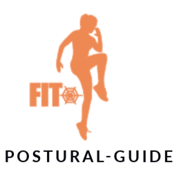

[TOC]

# 1. Description

## 1.1. Project Goals

This project KeepFit aims to streamline the fitness journey with an integrated solution that combines diet plans, exercise routines, and equipment management. By providing personalized diet and workout programs, which dynamically adjust to each user’s fitness schedule, it helps users pursue their goals more intelligently and efficiently. The equipment management feature guides users in selecting and optimizing fitness equipment usage. Through smart recommendations and real-time feedback, the project encourages healthy habits, supports the nationwide fitness movement, and fosters the adoption of a healthier lifestyle.

The purpose of this document is to illustrate the KEEP FIT's architectural analysis and analysis model. What's more, system function points are constantly being improved and snapshots of the user interface are constantly being updated.Therefore, we also include updated snapshots, use cases, and annotated references.

## 1.2. Project Scope

Keep-Fit is a Web-based smart fitness software, and the goal is to help users achieve their fitness goals smarter and more effectively. The main scenarios of the system include the selection of fitness tutorial, punching schedule, fitness posture guidance, food equipment recommendation and AI robot chat, etc. VIP members and ordinary users can browse information and participate in the activity after registering and logging in, and choose whether to become uploader. In addition, the platform administrators can maintain the platform order and keep the platform fitness content up to date.

Compared with the previous document, we added new content in each subsystem. The login part can be logged in using WeChat, QQ or TJ account; the progress tracking and data analysis and the tutorial part introduced the food tutorial; the action guidance system updated AI real-time chat; and the fitness equipment system imported into external shopping mall. This will be described in the later documentation.

  
  
  
  
  
  
  e

In addition, Keep-Fit also has the following characteristics:

- The platform system operates in a network environment.
- The system has an accurate recommended fitness tutorial algorithm.
- The intelligent system allows users to chat and consult with the AI.
- Have a safe and reliable database to ensure information security.

## 1.3. Target Readers and Suggestions

This document is intended for KEEP FIT developers, users, and all involved stakeholders. For an overview, readers are encouraged to begin with **Part 1**, which provides a brief introduction to the system. **Part 2** details updates to project goals and highlights progress made since the previous version, outlining recent changes in the system.

For insights into architectural choices, **Part 3** delves into the high-level architecture and system-level analysis of KEEP FIT. Focusing on functionality, **Part 4** presents sequence diagrams for use cases and class diagrams to guide further development. As the project advances, system functionality is being refined, with related use cases detailed in **Part 5**.

To get a visual summary of recent changes, **Part 6** contains update snapshots. **Part 7** lists open questions, including challenges and design tasks for the next phase. Finally, **Part 8** (Annotated References) provides references for this document, while **Part 9** acknowledges team contributions.

## 1.4. Glossary of Terms

| English terms                  | Terminology interpretation                                   |
| :----------------------------- | :----------------------------------------------------------- |
| **Keep-Fit**                   | The name of our project, the intelligent fitness platform, is designed to help users achieve their fitness goals smarter and more effectively. |
| **User**                       | The most basic users of the intelligent fitness platform can access the platform through registration, and use the most basic functions of the platform. |
| **VIP Member**                 | Ordinary users can become VIP members by recharging, and VIP members can use the richer functions in the platform, such as some paid tutorials, more intelligent AI chat systems and more accurate recommendation systems. |
| **Uploader**                   | Each kind of user(Users and VIP Members) can become a Uploaders by uploading exercise tutorials and sharing fitness experiences, and the Uploaders can also gain revenue and fans by selling paid fitness tutorials. |
| **Administrator**              | The administrator needs to maintain the order of the platform and the stability of the environment, and can ban the illegal users. You can also make announcements, upload new fitness tutorials, diet combinations and fitness equipment, and so on. |
| **Fitness** **Tutorial**       | Fitness tutorials are uploaded by uploaders or administrators, including paid and free, and cover a variety of fitness categories. |
| **Check-in**                   | After the user selects a fitness tutorial, the system automatically generates daily tasks and plans for the tutorial (the user can also plan the tutorial by himself/herself). Users need to complete the tasks every day to check in. |
| **AI** **Motion Detection**    | Users can upload photos of themselves during their workout process, and the system's AI will automatically check whether the exercise movements meet the specifications and give appropriate suggestions. |
| **Nutritional Composition**    | After the user selects a fitness tutorial, the system will automatically generate the recommended diet package of the tutorial, and give the nutritional composition of the package. Users can also take photos and upload daily diet pictures, and the AI system will automatically identify and give the nutritional content list of the diet. |
| **Reward** **Mechanism**       | Users need to complete the corresponding tasks every day according to the daily plan generated by the system(or tasks planning by himself/heself). After completing the tasks, they can get virtual rewards (such as level growth and platform transaction currency). |
| **Report**                     | Administrators regularly make announcements to various users of the platform, including some important notifications, new tutorials, and the latest feature points on the platform. |
| **Fitness** **Equipment**      | Each fitness course is accompanied by a series of required fitness equipment, the system will give the corresponding purchase links and size size recommendations. |
| **Chat Platform**              | In the chat platform, users can chat not only with their friends, but also with the system's AI robot, which can answer anything about fitness intelligently. |
| **Multi-device Access**        | Users can access and use the functions of the platform through different devices (such as personal computers, tablets, smartphones, etc.). This flexible access approach can improve the user experience and engagement. |
| **Intelligent Recommendation** | The system automatically generates personalized suggestions based on the users' personal information, fitness goals, history, and preferences. |

# 2. Introduction

## 2.1. Project Overview

The KeepFit system is a complete Web application containing the front-end Web end and back-end server parts. The server is responsible for processing user requests and interacting with the database to provide relevant data. Different user roles request different types of data from the server depending on their permissions. The server will return the corresponding data according to the role and permissions of the requester, such as tutorial management, device management, fitness records, and other functions. More detailed requirements and information will be further elaborated in the use case section, including the specific operational process and interaction details of each role.

## 2.2. Progress and Current Status

In the previous document, we provided readers with a comprehensive overview of the functionalities of KeepFit. This document builds upon that foundation by detailing the progress of our analysis model and architectural design.

This System Analysis Document presents the project's development through high-level architectural insights and the detailed architectural decisions made up to this stage. We have created a layered architecture diagram that outlines the structural hierarchy of the system and developed a package diagram to illustrate the components within each layer. 

To enhance system reliability and streamline development, we also include an in-depth analysis model comprising sequence diagrams and class diagrams.In addition, during the analysis phase, we identified the need for system updates to enhance functionality and user experience. We have also refined the system snapshots to reflect these enhancements, making the interface more user-friendly and functionally robust. 

## 2.3. Changes in the System

In the construction of the analysis model this time, we found that there were some operations can be optimized: 

Only allow access to the data through given interface to avoid direct access to the database, which may cause errors in the data of the database. Separate all classes into three parts: boundary class, control class and entity class to make the system clearer and safer. 

Add a some new functionalities to the existing system: Support for Wechat login in Login & Register System; Detailed tracking and data analysis in Fitness Tutorial Section; Dishes preparation tutorial in Fitness Diet Section; AI real-time chat in Fitness Action Coaching Section; Purchase in shopping malls in Fitness Equipment Section;Modify the use case diagram appropriately.

# 3. Architecture Analysis

KeepFit Is an intelligent fitness software for fitness and loved by the public. It needs to span multiple platforms (iOS, Android, Windows, Mac, Web) and provide services to users with different platforms and different personal information. Therefore, it is particularly important to design an architecture in line with the actual situation.

## 3.1. System-Level Architecture Analysis and Designs

In order to find the appropriate architecture model, we first need to use previous system use cases, system activities, etc The design, a more detailed analysis. After analysis, we found that KeepFit is composed of login registration subsystem, fitness course subsystem, healthy diet subsystem, action analysis subsystem and fitness equipment subsystem. Each system has strong independence and data with less overlapping data content. Therefore, we roughly divide our whole system into these five modules according to this classification.

As we all know, the traditional three-story building design is as follows:

We have preliminarily completed the architecture analysis and design of the system through the subdivision of the traditional three-layer logical system architecture. The system-level architecture can be as shown below:

Combined with the functions of the system, we integrated the above architecture design into our intelligent fitness system KeepFit system through the package diagram and components:

### 3.1.1. Presentation Layer

The presentation layer includes user interface information and components that facilitate user interaction. It handles user events through various components and encapsulates page data as a View Object (VO), allowing seamless transfer to application layer components for further business logic processing. Additionally, it can directly invoke external APIs to enable specific functionalities.

- **Interface Interaction Component**: This includes UI elements that directly interact with the user, such as buttons, input fields, and dropdown menus. These components are responsible for receiving user input and conveying the user's intentions to the system.
- **Data Encapsulation Component**: This component encapsulates the page's data state into a VO (view object) to facilitate transmission between layers. It converts complex page states into a format that’s easier to transfer, providing a consistent data interface for application layer logic.
- **Message Feedback Component**: Responsible for providing real-time feedback to the user, such as pop-up messages, error alerts, and success notifications. This component helps users understand the current system state and the results of their actions, enhancing the user experience.
- **Data Transmission Component**: This component manages data transfer between the presentation layer and the application layer or external APIs. It can use network requests or other methods to transfer encapsulated data to other services, enabling dynamic system responses and data synchronization.

### 3.1.2. Application Layer

The application layer facilitates data exchange between the presentation and business logic layers. It retrieves information from the View Object (VO) passed by the presentation layer, converts it into a Data Transfer Object (DTO), and then routes it to components in the business interface layer for processing. Additionally, data received from the business interface layer is restructured as a VO before being sent back to the presentation layer for user interaction.

- **Data Unpacking Component**: Handles the extraction of data from incoming VOs, preparing it for further application layer tasks.
- **Data Encapsulation Component**: Packages data into DTOs, formatting it for streamlined transfer to the business logic layer.
- **Data Transmission Component**: Manages the movement of data between the application layer and both the presentation and business logic layers, ensuring smooth data flow throughout the system.

### 3.1.3. External API Layer

The external API layer handles data objects from specific layers or subsystems, invokes external interfaces for logical processing, and returns the processed data objects for use by the subsystem or presentation layer.

- **Data Transmission Component**: Manages the flow of data between the external API layer and other system layers, ensuring seamless interaction.
- **External API**: Connects with external interfaces to perform necessary logic operations, enabling the exchange and processing of data across systems.

### 3.1.4. Business Interface Layer

The business interface layer represents the system's external functionality. It receives data from the controller layer, invokes the appropriate components in the business implementation layer to perform business logic processing, and then sends the processed information back through the business interface layer to the higher layers.

- **Data Transmission Component**: Facilitates data movement between the controller and business interface layers, ensuring efficient and reliable data flow.

- **Business Interface**: Acts as the access point for business logic, coordinating with implementation components to process requests and relay results back up the system.

### 3.1.5. Business Implementation Layer

The business implementation layer serves as the central component of the entire layered architecture, responsible for processing and executing the core business logic. This layer acts as the heart of the system, ensuring that all business rules, operations, and workflows are effectively handled, providing the necessary functionality for the application to meet its objectives.

+ **Data transmission component**

This layer takes in the data from the business interface layer and forwards it to the data access layer, ensuring it meets the specified business requirements.

+ **Business Implementation**

The business logic at a finer level of granularity is organized within the business implementation package. To facilitate depth-first iterative development, this package is further divided into distinct functional areas, each handling specific tasks or processes.

### 3.1.6. General Service Layer

The general service layer extracts the functional logic from the business implementation layer, aiming to enhance the reusability of business logic processing across the system.

+ **Data transmission component**

This layer receives data from the business interface layer and forwards it to the data access layer, ensuring that the data is handled in accordance with the specified business requirements.

+ **General Service**

The general service package includes a set of reusable business methods that can be accessed and invoked by the business implementation layer. These methods are designed to handle common tasks, ensuring consistency and efficiency in the execution of business logic across the system.

### 3.1.7. DTO Component Library

The DTO (Data Transfer Object) layer comprises various classes tailored to meet specific business logic requirements. Utilizing DTOs helps filter out unnecessary information during data transfer, enhancing operational efficiency and ensuring data security.

### 3.1.8. Business Entity Library

The **Business Entity Library** is a collection of classes or components that represent the core business entities in a software system. These entities are typically modeled based on the main data structures and concepts within the business domain the software is intended to support. 

In this system, we have abstracted entities such as the *cookbook*、*fitness equipment* based on different key functional points, in order to reduce interactions with the data access layer and enhance the security of data operations.

### 3.1.9. Data Access Layer

The main purpose of the Data Access Layer (DAL) is to provide a unified interface for upper-layer business logic to read and manipulate data through components like the Database Connection Component、 Data Cache component and so on, rather than directly interacting with the underlying database. This design enhances the system's maintainability, scalability, and security.

### 3.1.10. Common Service Library

The common services library includes various functional services closely integrated with all layers of the system architecture, such as file storage service component, monitoring service component and so on, providing components at each level with accessible functionalities, ensuring comprehensive support across the system.

## 3.2. Robustness Diagrams

Robust diagram is a graphic tool to analyze the requirements and design the system structure. It is an important step between connecting the use case diagram and the detailed design. Robust graphs show the interactive relationships of objects in the system, and classify the boundary, control, and entity classes of the system to facilitate understanding and refining the functional requirements.

### 3.2.1. Login & Register System

This part of the robust map mainly shows the interactive process of user login and registration, explaining how the user can enter the system through the interface operation and create and manage the account in the system. This section can help understand how to safely and effectively process user authentication information and ensure that user data management meets application logic.

### 3.2.2. Fitness Tutorial Section

This section describes how users can find, buy, watch, and generate personalized fitness tutorial plans in the intelligent fitness software. It also also includes how to track the user's fitness progress, analyze relevant data, and adjust their fitness plans according to their needs. The content shows the specific process of the user operation tutorial, and how these operations are handled and executed efficiently in the system. Through these functions, users can optimize according to their own situation, improve the fitness effect, and realize personalized fitness management.

### 3.2.3. Fitness Action Coaching Section

This part of the robust map shows how users can upload fitness videos to get the AI to detect movements and get punch card rewards. This part is designed to support the user's fitness movement specification guidance, ensure that its movements meet the predetermined standards, and provide incentives after successful punching in.

### 3.2.4. Fitness Equipment Section

This part of the robust map describes how users view, select and buy fitness equipment in the intelligent fitness software, how the system manages equipment information, how to use AI to recommend fitness equipment, and provides users with equipment recommendations. This part of the design to help users find the right fitness equipment and improve their fitness experience.

### 3.2.5. Fitness Diet Section

In this part of the robust map, the key steps and interactions of users' diet management and tracking in the application are mainly described. The graph allows users to view diet plans, edit personal needs, and analyze nutrients for comprehensive dietary guidance and progress feedback. The robust map also demonstrates how users can generate personalized diet plans and track their performance through interaction with the background AI system.

# 4. Analysis Model

## 4.1. Login & Register System

### 4.1.1. Class Diagram

### 4.1.2. Interaction Diagram

## 4.2. Fitness Tutorial Section

### 4.2.1. Class Diagram

This is a class diagram of the fitness tutorial section in the KeepFit intelligent fitness platform. The user category includes ordinary users and uploaders, providing registration, login, purchase tutorial and other functions. Tutorial class management tutorial content, status, and comments. The control class is responsible for business logic, such as tutorial search and purchase, AI plan generation, and administrator review. Boundary classes correspond to specific pages, including tutorial content, recharge, comments, and tutorial search pages. Users can purchase and view tutorials, uploaders can post new tutorials, and administrators can review tutorials and comments. The overall design enables the search, purchase, watch, comment and management functions of the fitness tutorial.

### 4.2.2. Interaction Diagram

+ **Tutorial View Interaction**

The interaction diagram describes the process of browsing the tutorial and purchasing it. First, the user enters the query in the tutorial search interface, the system retrieves the relevant tutorial through TutorialController and returns the tutorial list, and the user can view the detailed introduction. The user selects a specific tutorial to enter the details page, and the system checks whether the user has purchased the tutorial. If the purchase is not made, the system prompts the user to purchase, and the user confirms and then enters the payment page to enter the amount and confirm the purchase request. ChargeController Handle payment transactions and updates the user's account balances. After a successful purchase, the system allows users to access the tutorial details. The entire process shows the full user interaction of the tutorial browsing and buying.

+ **Tutorial Checkin Interaction**

The interactive diagram shows the user's punching in process in the tutorial. The user first starts to punch in, and the system calls the AI function through the TutorialController to detect the standardization of the user's action. If the test passes, the card is successful, and the system updates the user's punching record and rewards the corresponding points. If the test fails, the system prompts the user to try again. The user can also choose to generate the AI auxiliary plan, and the system generates a personalized plan according to the user's current training state. After that, the system records and analyzes the user's training data to help the user track the progress. This process fully reflects the interactive details of users' clocking, planning and training progress tracking in the intelligent fitness software.

+ **Upload  New Tutorial Interaction**

In the interactive diagram uploaded by the tutorial, the UP master first selects the new tutorial on the UploadTutorialPage page and fills in the relevant content. After filling in, the UP master clicks submit, and the page will save the tutorial draft through UploaderController. The UP master can select the preview and edit, and submit again after the modification is completed. When the tutorial content is confirmed, UploaderController will submit the tutorial to the administrator for review, and AdminController will check the content of the tutorial. After the approval, the status of the tutorial is updated to "released" and officially launched on the platform. If the audit fails to pass, it will be sent back to modify again. After the audit is completed, the UP master will get the corresponding virtual reward points to encourage them to continue to create quality content.

## 4.3. Fitness Action Coaching Section

### 4.3.1. Class Diagram

### 4.3.2. Interaction Diagram

## 4.4. Fitness Equipment Section

### 4.4.1. Class Diagram

### 4.4.2. Interaction Diagram

## 4.5. Fitness Diet Section

### 4.5.1. Class Diagram

### 4.5.2. Interaction Diagram

# 5. Update Requirements

# 6. Updated Snapshot

# 7. Open Questions

# 8. The Annotated References

# 9. Contributes

In the implementation process of the project, all members actively discuss and participate seriously, according to their respective interests and ability, to complete the task on time and with high quality. Harmonious team atmosphere, smooth communication and high efficiency. The division of labor and contribution of our group are like the following:

|          Members           | Part 1 | Part 2 | Part 3 | Part 4 | Part 5 | Part 6 | Part 7 | Part 8 | SCORE WEIGHT |
| :------------------------: | :----: | :----: | :----: | :----: | :----: | :----: | :----: | :----: | :----------: |
| 2154286  Weicheng Zheng |   √    |   √    |        |   √    |        |   √    |   √    |   √    |     25%      |
|  2253744  Juekai Lin   |   √    |        |   √    |   √    |   √    |   √    |        |   √    |     25%      |
|   2153085  Lixin Ma    |   √    |   √    |        |   √    |        |   √    |   √    |   √    |     25%      |
|  2154284  Junhao Yang  |   √    |        |   √    |   √    |        |   √    |        |   √    |     25%      |