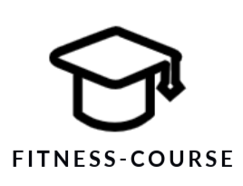
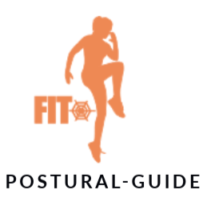

[TOC]

# 1. Introducion

## 1.1. Project Purpose

This project KeepFit aims to streamline the fitness journey with an integrated solution that combines diet plans, exercise routines, and equipment management. By providing personalized diet and workout programs, which dynamically adjust to each user’s fitness schedule, it helps users pursue their goals more intelligently and efficiently. The equipment management feature guides users in selecting and optimizing fitness equipment usage. Through smart recommendations and real-time feedback, the project encourages healthy habits, supports the nationwide fitness movement, and fosters the adoption of a healthier lifestyle.

This System Design Model Document (SDM document) aims to comprehensively explain the design model and architecture of the KeepFit system. The document details the overall structure of the system, including the functional modules of each subsystem, the interface relationship, and the data flow process. In addition, the document explores in depth the specific mechanisms of system prototyping, covering all stages, from requirements analysis to system implementation. In order to help to better understand and apply the design models, the document also provides some practical examples, showing how to flexibly configure and expand according to the specific business requirements. These contents will provide clear guidance for development, implementation and subsequent maintenance, and ensure the efficient and stable operation of the system.

## 1.2. Project Scope

Keep-Fit is a Web-based smart fitness software, and the goal is to help users achieve their fitness goals smarter and more effectively. The main scenarios of the system include the selection of fitness tutorial, punching schedule, fitness posture guidance, food equipment recommendation and AI robot chat, etc. VIP members and ordinary users can browse information and participate in the activity after registering and logging in, and choose whether to become uploader. In addition, the platform administrators can maintain the platform order and keep the platform fitness content up to date.

  
  
  
  
  
  
  

In addition, Keep-Fit also has the following characteristics:

- The platform system operates in a network environment.
- The system has an accurate recommended fitness tutorial algorithm.
- The intelligent system allows users to chat and consult with the AI.
- Have a safe and reliable database to ensure information security.

## 1.3. Glossary of Terms

| English terms                  | Terminology interpretation                                   |
| :----------------------------- | :----------------------------------------------------------- |
| **Keep-Fit**                   | The name of our project, the intelligent fitness platform, is designed to help users achieve their fitness goals smarter and more effectively. |
| **User**                       | The most basic users of the intelligent fitness platform can access the platform through registration, and use the most basic functions of the platform. |
| **VIP Member**                 | Ordinary users can become VIP members by recharging, and VIP members can use the richer functions in the platform, such as some paid tutorials, more intelligent AI chat systems and more accurate recommendation systems. |
| **Uploader**                   | Each kind of user(Users and VIP Members) can become a Uploaders by uploading exercise tutorials and sharing fitness experiences, and the Uploaders can also gain revenue and fans by selling paid fitness tutorials. |
| **Administrator**              | The administrator needs to maintain the order of the platform and the stability of the environment, and can ban the illegal users. You can also make announcements, upload new fitness tutorials, diet combinations and fitness equipment, and so on. |
| **Fitness** **Tutorial**       | Fitness tutorials are uploaded by uploaders or administrators, including paid and free, and cover a variety of fitness categories. |
| **Check-in**                   | After the user selects a fitness tutorial, the system automatically generates daily tasks and plans for the tutorial (the user can also plan the tutorial by himself/herself). Users need to complete the tasks every day to check in. |
| **AI** **Motion Detection**    | Users can upload photos of themselves during their workout process, and the system's AI will automatically check whether the exercise movements meet the specifications and give appropriate suggestions. |
| **Nutritional Composition**    | After the user selects a fitness tutorial, the system will automatically generate the recommended diet package of the tutorial, and give the nutritional composition of the package. Users can also take photos and upload daily diet pictures, and the AI system will automatically identify and give the nutritional content list of the diet. |
| **Reward** **Mechanism**       | Users need to complete the corresponding tasks every day according to the daily plan generated by the system(or tasks planning by himself/heself). After completing the tasks, they can get virtual rewards (such as level growth and platform transaction currency). |
| **Report**                     | Administrators regularly make announcements to various users of the platform, including some important notifications, new tutorials, and the latest feature points on the platform. |
| **Fitness** **Equipment**      | Each fitness course is accompanied by a series of required fitness equipment, the system will give the corresponding purchase links and size size recommendations. |
| **Chat Platform**              | In the chat platform, users can chat not only with their friends, but also with the system's AI robot, which can answer anything about fitness intelligently. |
| **Multi-device Access**        | Users can access and use the functions of the platform through different devices (such as personal computers, tablets, smartphones, etc.). This flexible access approach can improve the user experience and engagement. |
| **Intelligent Recommendation** | The system automatically generates personalized suggestions based on the users' personal information, fitness goals, history, and preferences. |

## 1.4. Progress on System Design

In the previous report, we have completed the analytical model design of the KeepFit intelligent Fitness system, and presented in detail the user interface, system architecture and class diagram in this section. Based on the results of these preliminary work, this document further clarifies and improves the micro-service architecture design of the platform. We will provide more specific technical architecture and logical architecture models, and design detailed interfaces for the different modules of the project. The paper will also thoroughly describe the use of some third-party API, the design of an interface of the sub-system, the implementation of the analysis mechanism, the specific operation of the use case and the design of the system prototype. We focused on the specific implementation design of the project, elaborated on the main technology stack needed to achieve the project, and defined the specific way in which the project was implemented.

The improvement and enhancement of the platform design are mainly reflected in the following aspects:

+ **Reconfigure the logical structure and functional mechanisms**

Through in-depth analysis of the mechanism and functions of the platform, we redesigned the logical structure of the system, and optimized and adjusted the various functions of the system to meet the actual needs of the project.

+ **Add technical and physical architecture design**

In addition to the original logical architecture, we also further expand the design of the technical architecture and the physical architecture. For each function of the layer, we detail the required technology stack and provide the deployment scheme of the system at the physical level to ensure the efficient operation of the system.

+ **Optimize the interface design and detailed description**

We have carried out more detailed planning in interface design, providing new subsystems and various modules with more specific interface design, including the type of interface parameters, return value type and details of data transmission. For the interfaces of third-party services and some subsystems, we have also made detailed instructions to ensure the smooth and stable interface call.

+ **Improve the safety and reliability of the system**

To improve the security and reliability of the platform, we have adopted the API gateway, the data persistence mechanism, and a range of design solutions. These designs effectively enhance the fault tolerance, flexibility, and scalability of the system, ensuring that the platform operates stably in a high-concurrency, high-load environment.

+ **Analyze the mechanism and select the appropriate design mode**

We have made an in-depth analysis of the mechanism in the platform and selected the most suitable design mode to improve the performance and scalability of the system and ensure the scientific and high efficiency of the system design.

+ **System analysis and design by using the design mode**

In the analysis and design process of the system, we have widely used a variety of design modes to ensure that the system has good maintainability, scalability and high efficiency.

+ **Practice part of the project development work and propose the prototype design**

In the actual development process, we personally participated in the construction of some project modules, carried out the development and implementation of some functions, and proposed the system prototype design, so as to better verify the feasibility and user experience of the system.

+ **Combine the user use case and the system structure analysis and implementation mode**

By combining user use cases with the system structure of the platform, we deeply analyzed the implementation process of the system to ensure that each use case can be efficiently connected with the system architecture, so as to improve the overall performance and user experience of the system.

Through these improvements and enhancements, this design document not only provides a more detailed and clear diagram of the system architecture, but also ensures that the platform can operate efficiently during the implementation process to meet the needs of future expansion and innovation.

## 1.5. The Platform and Architecture

In the actual development process, we will use a microservice architecture to develop our KeepFit intelligent fitness system. The architecture enables each microservice in the system to be deployed independently and loosely coupled to each other. Each microservice focuses on completing a single function and implementing it in an optimum way. This architecture design brings low coupling, high flexibility, specific solutions to specific problems, and is conducive to independent development. In addition, the microservice architecture also enhances the availability and stability of the system. Under this architecture, we will use a series of mature technologies and frameworks to build the system. The implementation of each subsystem and component is summarized as follows:

+ **Web application**

We will use Flutter, Material-UI, Panache, Supernova, Sylph, Codemagic and other tools to build the front-end framework, and use AJAX technology to dynamically update the page content without refreshing the page to improve the user experience.

+ **API gateway**

The API gateway will be implemented through Spring Cloud Alibaba, as a unified external interface to provide microservice support. Spring Cloud Alibaba provides key components for building distributed applications, allowing developers to easily develop and manage various services in the microservice architecture through the Spring Cloud programming model.

+ **Security**

The security certification of the system will use Sa-Token, a lightweight licensing framework that can meet the security requirements of the platform. Certification and authorization through this framework can effectively guarantee the security of the platform and support security testing. 

+ **Data storage**

In terms of data storage, we will combine a variety of database technologies. The relational database MySQL is used to store structured data, the document database MongoDB is used to store unstructured data, MinIO will be used for object storage, and Redis provides efficient cache and data consistency support in high concurrency scenarios to ensure the security and high availability of data. 

+ **Service framework**

Backend development will be based on Spring Boot, using its strong scalability and excellent performance to build server systems. We will develop using the Java language, and Spring Boot provides the ideal environment for developing high-performance, scalable network applications.

Through the integrated application of these technologies and frameworks, we are able to build an efficient, stable and highly scalable microservice architecture system to meet the various needs of the KeepFit intelligent fitness platform.

## 1.6. Architecture Style

In the modern software architecture design, we abandon the traditional single architecture and instead adopt a more flexible and efficient microservice architecture. The core idea of this architecture style is to deconstruct complex systems into multiple lightweight, independent and autonomous service units, with each micro-service focused on performing specific business functions. With this decentralized design approach, we significantly improve the overall performance and resilience of the system. Unlike traditional single large applications, the micro-service architecture allows development teams to respond more quickly to changing business requirements, enabling rapid iteration of technology and business through loosely coupled service design. Each micro-service is a relatively independent business boundary, with its own data storage, business logic and communication interface, thus forming a highly decoupled and portfolio system ecosystem.

Due to the high completeness and independence of the services provided by HW, it can be conveniently packaged into different microservice clusters and applied to other systems. Therefore, the system adopts the micro-service architecture design, with the characteristics of high cohesion and low coupling, and each service can be deployed independently. The microservice architecture also has the advantages of flexible development, support for rapid iteration and update, which can well meet the functional requirements of the current system. In the microservice architecture, we conduct an in-depth analysis of the design of individual applications, as described below.

According to the classification of software architecture styles by Garlan and Shaw, software architecture styles are mainly divided into the following five categories:

+ **Data flow style** including batch sequence and pipeline / filter mode.
+ **Call / return style** including the master program / subprogram, object-oriented style, and hierarchy.
+ **Independent component style** including inter-process communication and event-driven systems.
+ **Virtual machine style** including interpreter and rule-based systems.
+ **Warehouse style** including database system, hypertext system and blackboard system.

In designing the system, the overall architecture adopts a call / return style, with a focus on data-based abstraction and object-oriented design concepts. In the hierarchical design, we gradually expand from local to whole to ensure that the system has clear hierarchy and good scalability while meeting the requirements.

## 1.7. Design Patterns

In the development process of the intelligent fitness platform, we follow the following design patterns:

+ **Singleton Pattern**

The singleton mode is a common design mode, designed to ensure that a class has only one instance, and that it provides a global access point to obtain that instance. By using the singleton mode, you can avoid resource waste and management problems caused by creating multiple instances, especially for data or services that require global sharing.

In our smart fitness system, we use the singleton mode to manage the data of the current users. After the user logs in, the current user information is saved in a singleton class to ensure that this unique user data is shared by other modules in the application without repeating user objects. At the same time, the default Settings of the fitness plan or the global system configuration (such as the reward system, AI detection rules, etc.) can be managed in the singleton mode to ensure the consistency and global accessibility of the configuration items.

+ **Observer Pattern**

The observer pattern is a behavioral design pattern that defines a one-to-many dependency that allows multiple observers to listen on the state changes of a single subject object. When the state of a subject object changes, all observers who depend on it are notified and automatically updated.

In our intelligent fitness system, the observer mode can be used for multiple scenarios, such as the user subscribing to their own target progress update, the fitness plan management module as the theme, and the user interface or the notification module as the observer, and the user can view the progress of the task in real time. When the user's fitness progress changes, multiple observers will receive notification and automatically update relevant content, such as reward distribution, data statistics, etc.

+ **Strategy Pattern**

The strategy mode allows for the selection of the behavior of the algorithm at runtime. In strategy patterns, a series of algorithms is defined and each algorithm is encapsulated into a separate class so that they are interchangeable. The strategy mode makes the algorithm change independent of the customer using the algorithm.

In our intelligent fitness system, different recommendation algorithm strategies are selected according to users' needs and preferences. For example, users prefer to learn through a video tutorial and can choose a content recommendation strategy. The recommendation system can flexibly switch between different recommendation algorithms through the strategy pattern to improve the user experience.

+ **Responsibility Chain Pattern**

The responsibility chain mode is a behavioral design mode that forms a chain by connecting multiple processing objects in series to form a chain in which a client request passes along the chain until an object processes the request. The main purpose of this pattern is to give multiple objects the opportunity to process the request, thus avoiding the coupling between the request sender and the receiver.

In the intelligent fitness system, the responsibility chain mode can be used to process a series of fitness tasks, user operation requests, data processing processes, etc. Especially when a request or operation needs to go through multiple processing steps, such as the training task audit process, the user feedback processing process, and the user training plan update process.

+ **Proxy Pattern**

The proxy mode provides a proxy for other objects to control the access to that object. The agent mode accesses the real objects indirectly by introducing the agent objects. The agent objects can perform some additional operations before and after accessing the real objects, such as permission control, delayed loading, caching, etc.

In smart fitness systems, video tutorials may require permission control. Only users who have purchased or unlocked the relevant tutorial can access the video content. Using proxy mode, proxy objects can control access to video tutorials, ensuring that only authorized users can watch it. At the same time, the proxy object can create an AI object on the first request and call the object directly in later requests, rather than creating every time, thus improving performance.

## 1.8. Critical Design Decisions

+ In our system, all images and video resources uploaded by users are stored in Alibaba Cloud OSS and returned to the front-end for display through generated URLs. This approach not only provides high reliability and availability, ensuring secure and stable access to data, but also supports high concurrency processing and low latency, enhancing the user experience.
+ The microservice architecture we use is extremely flexible, can adapt well to the agile development process, and has advantages beyond traditional architectures in terms of system reconstruction and continuous integration. In addition, the deployment and expansion of the micro-service architecture enable us to make full use of the advantages of the cloud platform in the operation and maintenance process, effectively control costs and improve the maintainability of the system.
+ In every link of the system design, we always put the user privacy protection in the first place. In addition to the strict permission control based on sa-token, we also plan to implement encryption at the database level and adopt disk-level hardware encryption technology to ensure the security of user data. In the process of data collection and analysis, we will use desensitized data, so as to effectively protect user privacy.
+ Using ElPlus and Vue to build our UI: Vue as a popular front-end framework provides an efficient development experience and a flexible component structure that can quickly respond to user needs. The introduction of ElPlus further improves the standardization and consistency of UI design, making the front-end interface more modern and user-friendly, thus bringing a smoother user experience.
+ Based on the concept of object-oriented programming, combined with the domain-specific technology stack: our projects mainly use the Springboot technology stack for development and process most of the business logic. However, in some specific services, thanks to the flexibility of the micro-service architecture, we adopt a dedicated technology stack in the corresponding field to improve the development efficiency and system performance.

# 2. Architecture Refinement

## 2.1. Platform-dependent Architecture

In the previous logical architecture design of our Keep Fit Platform, we focused heavily on the completeness of internal system functions and the security of data transmission. However, considering the increasing number of users and business complexity, the original layered architecture has gradually exposed some problems, such as poor system scalability, low development and deployment efficiency, and wide impact of failures. Therefore, we have decided to adopt a microservices architecture based on Domain Driven Design (DDD) to improve and upgrade the system logic architecture.

+ **Microservices Segmentation**

Our platform can be divided into multiple microservices that are both interrelated and relatively independent:

1. **Login and Registration Microservice**: Handles user login and registration functions.
2. **Fitness Tutorial Microservice**: Includes features such as fitness tutorial recommendations, learning, and fitness check-ins.
3. **AI Fitness Coach Microservice**: Includes features such as using AI to analyze whether users' fitness movements are standard, recommending fitness equipment, intelligent Q&A with fitness equipment, and intelligent price comparison for fitness equipment.
4. **Healthy Diet Microservice**: Includes features such as users setting meal plans based on system recommendations, recording dietary intake, and AI analysis of dietary habits.

+ **Microservices Integration**

Previously, we had separated AI fitness movement analysis and fitness equipment into two subsystems. However, this time we have merged them into a single microservice. This is because these two functions are highly related in actual use. Merging them allows for better coordination and optimization of user workflows, reduces inter-service communication overhead, and improves overall performance.

+ **Interdependencies Between Microservices**

1. **Fitness Tutorial Microservice** influences the fitness equipment recommendation function in the **AI Fitness Coach Microservice**. When users learn specific fitness tutorials, the system recommends appropriate fitness equipment based on the tutorial content.
2. **Fitness Check-in Function** in the **Fitness Coach Microservice** must be validated by the **AI Fitness Coach Microservice** to ensure that the user's fitness movements are standard. Only when the user's movements meet the standards will the system record a successful check-in.
3. **Healthy Diet Microservice** recommends meal plans based on the ongoing fitness tutorials in the **Fitness Tutorial Microservice**. After AI analysis of the user's dietary habits, it intelligently adjusts the fitness plan in the **Fitness Tutorial Microservice**. For example, if a user is undergoing high-intensity training, the system might suggest increasing protein intake.

+ **Advantages of Adopting a Microservices Architecture**

1. **Improved Development Efficiency**: Teams can develop different microservices in parallel, accelerating development and delivery speeds.
2. **Independent Deployment and Scaling**: Each microservice can be independently deployed and scaled without affecting other services, enhancing the system's flexibility and maintainability.
3. **Fault Isolation**: A failure in one service does not affect others, improving the system's stability and reliability.
4. **Continuous Delivery and Support**: Supports Continuous Integration and Continuous Delivery (CI/CD), facilitating rapid iteration and feature releases.

Based on the above content, the logical architecture of this system is as follows:

+ **Technical Stack for the Microservices Architecture**

To ensure the microservices architecture scales effectively with the project size, we continue to use separate front-end and back-end development approaches. The front-end is developed using frameworks and libraries such as Vue and Sencha, while the back-end is built using Spring Boot and Spring Cloud. Communication between the front-end and back-end occurs through RESTful APIs and JSON data files. Data layers communicate and transform data using different models, such as Value Objects (VO), Data Transfer Objects (DTO), and Domain Objects (DO).

For authorization and authentication, the system uses sa-token. Comprehensive log collection and data analysis visualization are provided by the ELK stack. To efficiently handle asynchronous messages and traffic management, ActiveMQ is used for message passing and storage. The back-end persists data to Oracle databases or Redis caches using the Hibernate persistence mechanism.

Based on these technologies, the technical stack diagram for the system is as follows:

| API Interface                               | Method | Parameters                      | Description                                                  |
| ------------------------------------------- | ------ | ------------------------------- | ------------------------------------------------------------ |
| /api/tutorial/tutorialSearch                | GET    | token, keyword                  | Through this interface, users find the relevant fitness tutorial through keyword search and return a list of matching tutorials. |
| /api/tutorial/{tutorialID}/tutorialInfo     | GET    | token, tutorialId               | The interface uses the user to obtain the details of the specified fitness course, including the course name, introduction, duration, difficulty, etc. |
| /api/tutorial/{tutorialID}/tutorialPurchase | POST   | token, tutorialId               | The user buys the specified unlocked tutorial through this interface to return whether the purchase is successful. |
| /api/tutorial/{tutorialID}/tutorialPlay     | GET    | token                           | Users can watch the purchased or unlocked fitness tutorial videos through this interface. |
| /api/tutorial/{tutorialID}/planGenerate     | POST   | token, tutorialId               | This interface can generate a personalized fitness plan and return the generated plan content. |
| /api/tutorial/{tutorialID}/planAIadjust     | PUT    | token, tutorialId               | The user adjusts the fitness plan through this interface, and changes it according to the suggestions of AI assistance. |
| /api/tutorial/{tutorialID}/fitProgress      | POST   | token, tutorialId               | The user uploads the fitness training data through this interface, and the system tracks the user's fitness progress. |
| /api/tutorial/{tutorialID}/dataAnalysis     | GET    | token, tutorialId               | The system provides the data analysis function, show the user's fitness performance and trend, and generate the analysis report. |
| /api/tutorial/progressReport                | GET    | token, tutorialId, reportType   | Users can export detailed fitness progress reports in different formats, view data, trends, and suggestions for improvement. |
| /api/tutorial/{tutorialID}/tutorialCheckin  | POST   | token, actionId,imgUrl/videoUrl | Users upload photos or videos during the fitness process through the interface to punch in, and the system detects the standardization of AI movements. |
| /api/tutorial/rewardGet                     | GET    | token, tutorialId               | The corresponding virtual reward obtained after the user completes the task and clocks in is recorded in the database. |
| /api/tutorial/tutorialRecommendation        | POST   | token                           | The system recommends suitable tutorials and plans based on the user's fitness history and progress, and returns a personalized recommendation list. |
| /api/tutorial/newTutorialUpload             | POST   | token, newTutorialContents      | The Uploader uploads a new fitness tutorial through this interface, and submits the basic information of the tutorial (such as the tutorial name, brief introduction, length, difficulty, etc.). |
| /api/tutorial/tutorialApprove               | PUT    | token, newTutorialContents      | The administrator reviews the newly uploaded tutorial through this interface. After the audit, the tutorial becomes available, and the failure information is returned. |
| /api/tutorial/releaseComment                | POST   | token, tutorialId, comment      | The user evaluates the specified tutorial through this interface. |
| /api/tutorial/commentApprove                | PUT    | token, tutorialId, comment      | The administrator reviews the user's tutorial evaluation through this interface, and the approved evaluation will be displayed on the tutorial page. |
